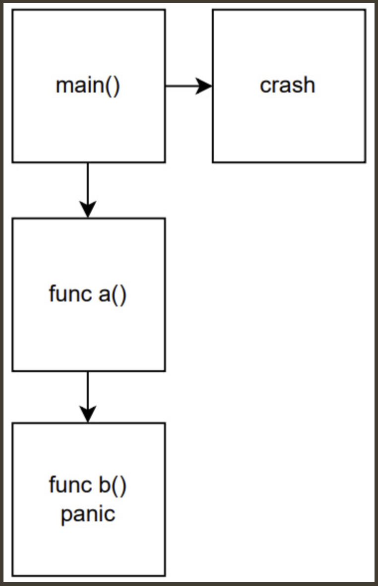
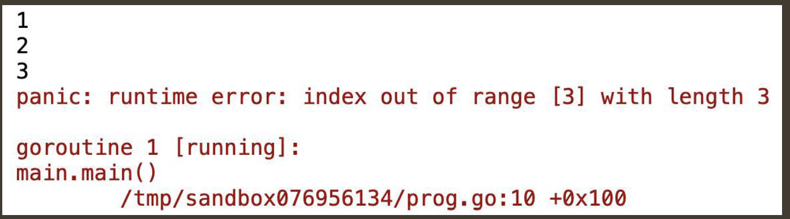

When a panic occurs, it will generally follow these steps:
1. The execution is stopped.
2. Any deferred functions in the panicking function will be called.
3. Any deferred functions in the stack of the panicking function will be called.
4. It will continue up the stack until it reaches main().
5. Statements after the panicking function will not execute.
6. The program then crashes.

Here's how a panic works:


The preceding diagram illustrates code in the main function that calls the a() function. This function then calls the b() function. Inside b(), a panic occurs. The panic() function is not handled by any of the code upstream (a() or the main() function), so the program will crash the main() function.

--------
Here’s an example of a panic that occurs in Go. Try to determine why this program panics:
```go
package main
import (
    "fmt"
)
func main() {
    nums := []int{1, 2, 3}
    for i := 0; i <= 10; i++ {
        fmt.Println(nums[i])
    }
} 
```
The output of this panic is shown here:


The panic runtime error is a common one that you will encounter while developing. It is an index out of range error. Go generated this panic because we are trying to iterate over a slice more times than there are elements. Go felt that this is a reason to panic because it puts the program in an abnormal condition.