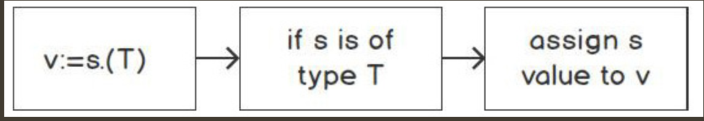

Type assertion provides access to an interface’s concrete type. Remember that interface{} can be any value:
```go
package main
import (
  "fmt"
)
func main() {
  var str interface{} = "some string"
  var i interface{} = 42
  var b interface{} = true
  fmt.Println(str)
  fmt.Println(i)
  fmt.Println(b)
}
```
The type assertion output would look as follows:
```
some string
42
true
```
In each instance of the variable declaration, each variable is declared as an empty interface, but the concrete value for str is a string, for i is an integer, and for b is a Boolean.

When there is an empty interface{} type, sometimes, it is beneficial to know the underlying concrete type. For instance, you may need to perform data manipulation based on that type. If that type is a string, you would perform data modification and validation differently from how you would if it was an integer value. This also comes into play when you are consuming JSON data of an unknown schema. The values in that JSON might be known during the ingesting process. We would need to convert that data to map[string]interface{} and perform various data massaging, or transformation of the data based on its underlying type or structure.

-----
```
v := s.(T)
```
The preceding statement says that it asserts that the interface value s is of type T and assigns the underlying value of v:



