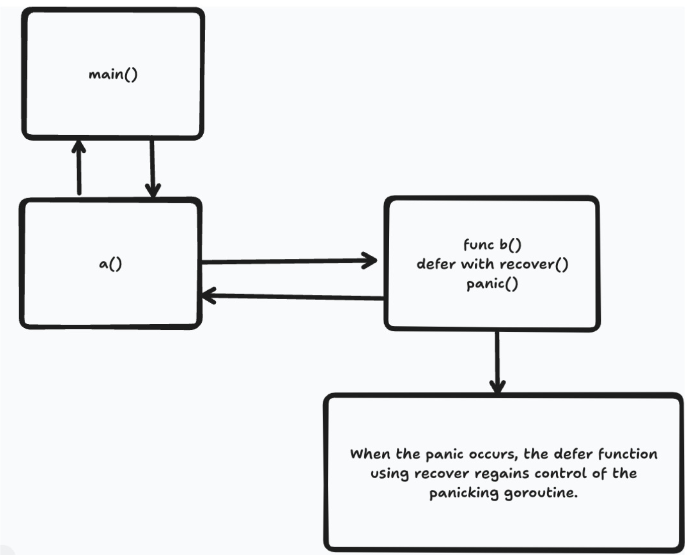
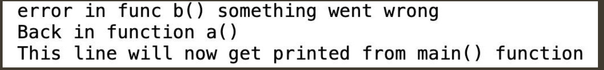

The following diagram shows the steps a program would take when using panic(), recover(), and a defer() function:



The steps that are taken in the preceding diagram can be explained as follows:
1. The main() function calls func a().
2. func a() calls func b().
3. Inside func b(), there is a panic.
4. The panic() function gets handled by a deferred function that uses the recover() function.
5. The deferred function is the last function to execute inside func b().
6. The deferred function calls the recover() function.
7. The call to recover() causes normal flow back to the caller, func a().
8. Normal flow continues, and control is finally given back with the main() function.

------
The following code snippet mimics the behavior of the preceding diagram:
```go
main.go

func main() {
    a()
    fmt.Println("This line will now get printed from main() function")
}
func a() {
    b("good-bye")
    fmt.Println("Back in function a()")
}
func b(msg string) {
    defer func() {
        if r := recover(); r!= nil{
            fmt.Println("error in func b()", r)
    }
}()
```
Code synopsis:
- The main() function calls the a() function. This calls the b() function.
- b() accepts a string type and assigns it to the msg variable. If msg evaluates to true in the if statement, a panic will occur.
- The argument for the panic is a new error created by the errors.New() function:
```go
if msg == "good-bye" {
    panic(errors.New("something went wrong"))
}
```
Once the panic occurs, the next call will be to the deferred function.
The deferred function uses the recover() function. The value of the panic is returned from recover(); in this case, the value of r is an error type. Then, the function prints out some details:
```go
defer func() {
    if r := recover(); r!= nil {
        fmt.Println("error in func b()", r)
    }
}()
```
- The control flow goes back to a(). Then, the a() function prints out some details.
- Next, control goes back to the main() function, where it prints out some details and terminates.
