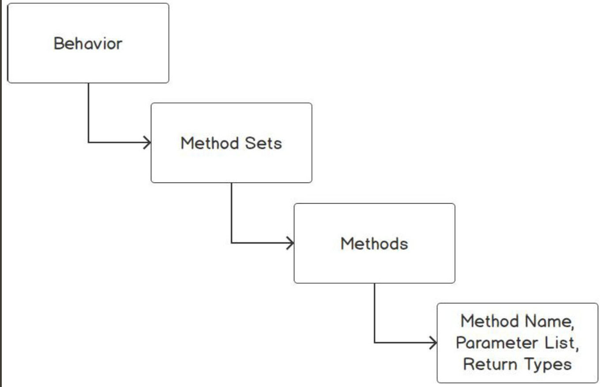
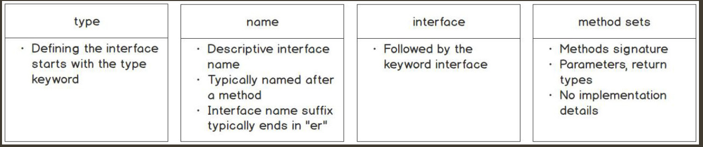

There are several ways to describe an interface:
- A collection of method signatures is methods with only the name of the method, its arguments, types, and a return type. This is an example of a collection of method signatures for the Speaker{} interface:
    ```go
    type Speaker interface {
        Speak(message string) string
        Greet() string
    }
    ```
- Blueprints of the type’s methods are needed to satisfy the interface. Using the Speaker{} interface, the blueprint (interface) states that to satisfy the Speaker{} interface, the type must have a Speak() method that accepts a string and returns a string. It also must have a Greet() method that returns a string.
- Behaviors are what the interface type must exhibit. For example, the Reader{} interface has a Read method. Its behavior is the reading of data. The following code is from the Go standard library’s Reader{} interface:
    ```go
    type Reader interface {
        Read(b []byte)(n int, err error)
    }
    ```
- Interfaces can be described as having no implementation details. When defining an interface, such as the Reader{} interface, it only contains the method signatures without the actual code implementation. The responsibility for supplying the code or implementation details lies with the type that implements the interface, not the interfaces themselves.

---------------
Behaviors of a type are collectively called method sets, which are collections of methods associated with that type. A method set encompasses the names of methods defined by an interface, along with any input parameters and return types. For example, a type may exhibit behaviors such as Read(), Write(), and Save(). These behaviors collectively form the method sets of the type, providing a clear definition of what actions or functionalities the type can perform.


When talking about behaviors, note that we did not discuss the implementation details. Implementation details are omitted when you define an interface. It is important to understand that no implementation is specified or enforced in the declaration of an interface.

Interfaces focus on the behaviors that the type must exhibit. It is not the job of the interface to provide method implementations. That is the job of the type that is implementing the interface.

---------------
Defining an Interface
