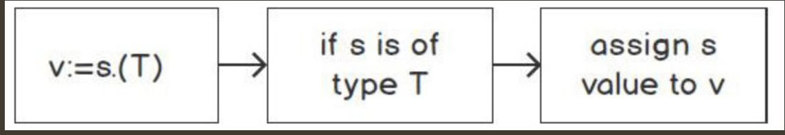

`Type assertion` provides access to an interface’s concrete type. Remember that `interface{}` can be any value:
```go
package main
import (
  "fmt"
)
func main() {
  var str interface{} = "some string"
  var i interface{} = 42
  var b interface{} = true
  fmt.Println(str)
  fmt.Println(i)
  fmt.Println(b)
}
```
The type assertion output would look as follows:
```
some string
42
true
```
In each instance of the variable declaration, each variable is declared as an empty interface, but the concrete value for str is a string, for i is an integer, and for b is a Boolean.

When there is an `empty interface{} type`, sometimes, it is beneficial to know the underlying concrete type. For instance, you may need to perform data manipulation based on that type. If that type is a string, you would perform data modification and validation differently from how you would if it was an integer value. This also comes into play when you are consuming JSON data of an unknown schema. The values in that JSON might be known during the ingesting process. We would need to convert that data to map[string]interface{} and perform various data massaging, or transformation of the data based on its underlying type or structure.

-----
```
v := s.(T)
```
The preceding statement says that it asserts that the interface value s is of type T and assigns the underlying value of v:


-----
There will be times when you do not know the empty interface concrete type. This is when you will use a `type switch`. A type switch can perform several types of assertions; it is similar to a regular switch statement. It has a case and default clauses. The difference is that type switch statements evaluate for a type rather than a value.
Here is a basic syntax structure:
```go
switch v := i.(type) {
    case S:
    // code to act upon the type S
}
```
`i.(type)` The syntax is like that of the type assertion, i.(int), except the specified type, int in our example, is replaced with the type keyword. The type being asserted of type i is assigned to v; then, it is compared to each of the case statements.

`case S:` In the switch type, the statements evaluate for types. In regular switching, they evaluate for values. Here, it is evaluated for a type of S.
```go
func typeExample(i []interface{}) {
    for _, x := range i {
    switch v := x.(type) {
        case int:
            fmt.Printf("%v is int\n", v)
        case string:
            fmt.Printf("%v is a string\n", v)
        case bool:
            fmt.Printf("a bool %v\n", v)
        default:
            fmt.Printf("Unknown type %T\n", v)
        }
    }
}
```