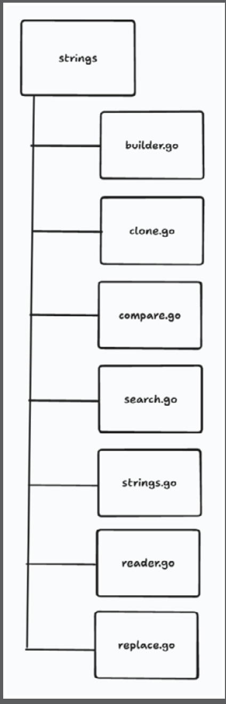

### OVERVIEW

This chapter aims to demonstrate the importance of the use of packages in our Go programs. We will discuss how packages can be used to assist our code in being more maintainable, reusable, and modular. In this chapter, you will see how they can be used to bring structure and organization to our code. This will also be seen in our exercises, activities, and some examples from the Go standard library.

We will look at how Go organizes its code into packages. We will see how we can hide or expose different Go constructs such as structs, interfaces, functions, and more, using packages. Our programs have been rather small in the number of lines of code and in complexity to a certain extent. Most of our programs have been contained in a single code file, often named `main.go`, and inside a single package named main. This will not always be the case when you are working on a development team. Often, your code base can become rather large, with multiple files, multiple libraries, and multiple members of the team. It would be rather restrictive if we could not break our code into smaller, manageable parts. The Go programming language solves the complexity of managing large code bases with the ability to modularize similar concepts into packages. The creators of Go use packages for their own standard libraries to tackle this problem.

Let’s look at an example of a package structure from the Go standard library. The Go strings package encapsulates string functions that manipulate strings. By keeping the strings package focused on only the functions that manipulate strings, we, as Go developers, know that this function should contain all that we need for string manipulation.
The Go strings package is structured as follows (https://pkg.go.dev/strings#section-sourcefiles):

The preceding diagram shows the `strings` package and the files that are in the package. Each file in the `strings` package is named after the functionality it is supporting. The logical organization of the code goes from package to file. We can easily conclude that the `strings` package contains code for manipulating `strings`. We can then further conclude that the replace.go file contains functions for replacing `strings`. You can already see that the conceptual structure of packages can organize your code into modular chunks. You start with code that is working together to serve a purpose, string manipulation, and it gets stored in a package called `strings`. You can then further organize the code into `.go` files and name them according to their purpose. The next step is keeping functions in there that perform a single purpose that reflects the name of the file and the name of the package. We will discuss these conceptual ideas later in the chapter when we discuss structuring code.
It is important to develop software that is maintainable, reusable, and modular. Let’s briefly discuss each of these core components of software development.
