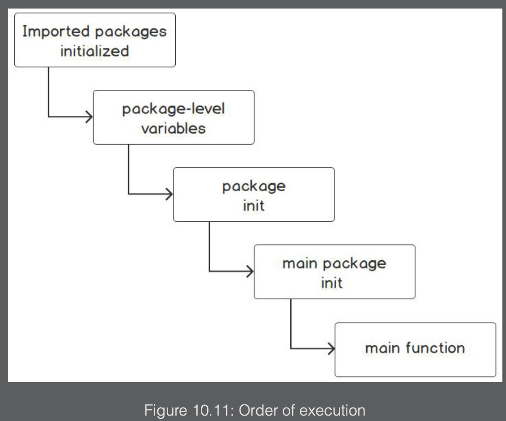
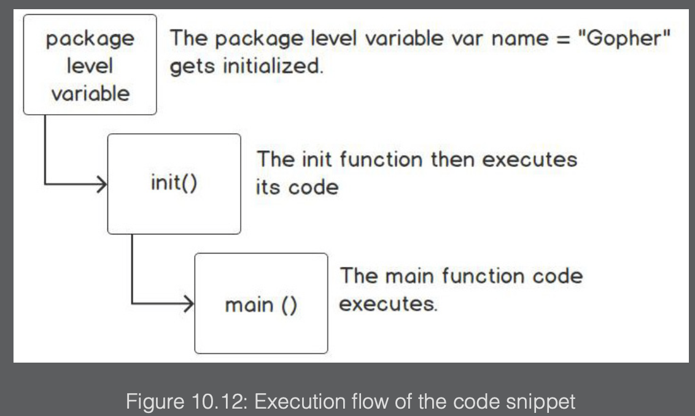
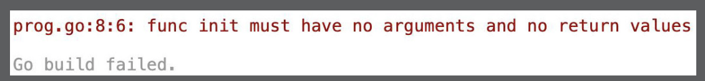

Every Go program (executable) starts in the main package and the entry point is the `main()` function. There is another special function that we should be aware of, called `init()`.

Each source file can have an `init()` function, but for now, we will look at the `init()` function in the context of the main package. When you start writing packages, you might need to provide some initialization (the `init()` function) for the package. The `init()` function is used to set up states or values. The `init()` function adds initialization logic for your package. Here are some examples of uses of the `init()` function:

- Setting database objects and connections
- The initialization of package variables
- Creating files
- Loading configuration data
- Verifying or repairing the program state

The `init()` function requires the following:

- Imported packages are initialized first
- Package-level variables are initialized
- The package’s `init()` function is called
- `main()` is executed



Here is a simple example that demonstrates the package main order of execution:

```go
package main
import (
    "fmt"
)

var name = "Gopher"
func init() {
    fmt.Println("Hello,", name)
}
func main() {
    fmt.Println("Hello, main function")
}
```

The output of the code is as follows:

```
Hello, Gopher
Hello, main function
```

Let’s understand the code in parts:

```
var name = "Gopher"
```

Based on the output of the code, the package-level variable declaration gets executed first. We know this because the name variable is printed in the `init()` function:

```go
func init() {
    fmt.Println("Hello,", name)
}
```

The `init()` function then gets called and prints out "Hello, Gopher":

```go
func main() {
    fmt.Println("Hello, main function")
}
```

Finally, the `main()` function is executed:


The `init()` function cannot have any arguments or return values:

```go
package main

import (
    "fmt"
)

var name = "Gopher"
func init(age int) {
    fmt.Println("Hello, ", name)
}
func main() {
    fmt.Println("Hello, main function")
}
```

Running this code snippet will result in the following error:


---

### Executing multiple init() functions

There can be more than one `init()` function in a package. This enables you to modularize your initialization for better code maintenance. For example, suppose you need to set up various files and database connections and repair the state of the environment your program will be executed in. Doing all that in one `init()` function would make it complicated for maintaining and debugging.
