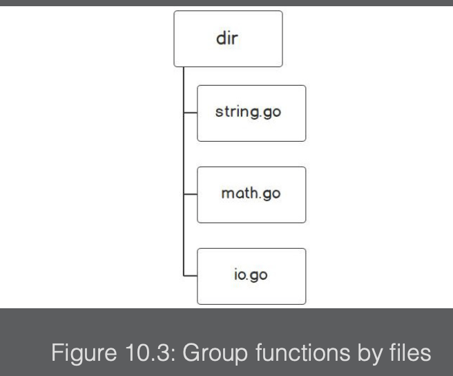
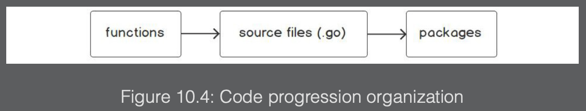
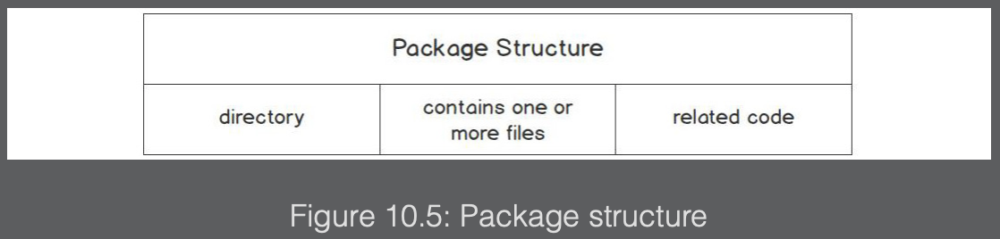
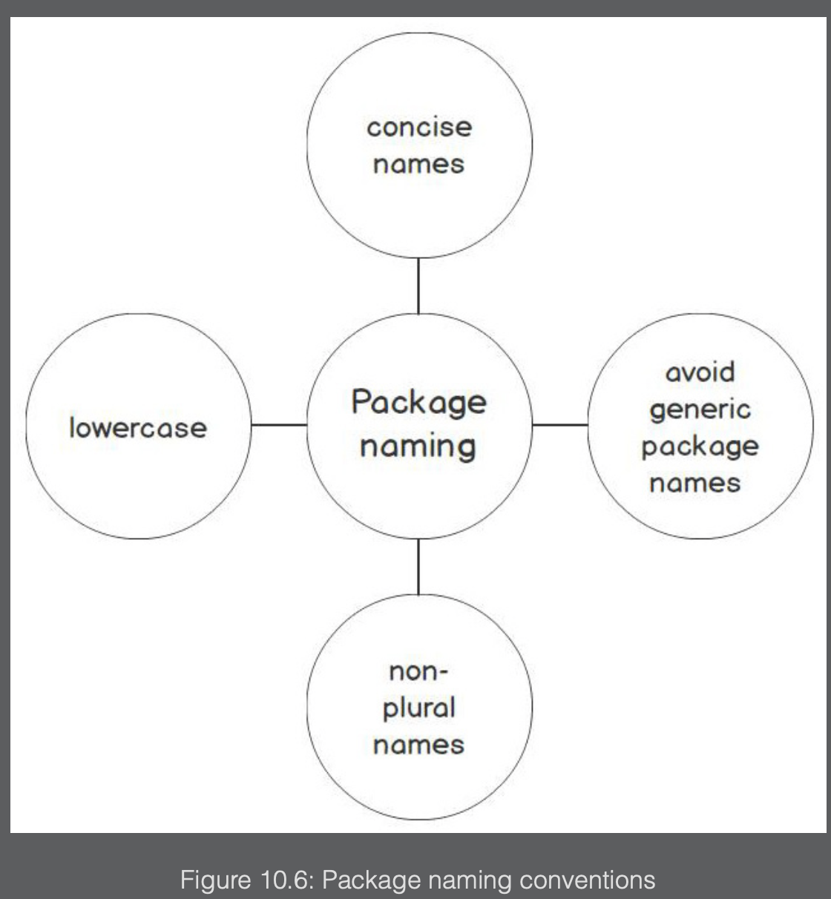

### What is a package?

Go follows the `Don’t Repeat Yourself (DRY)` principle.

This means that you should not write the same code twice. Refactoring your code into functions is the first step of the DRY principle.

- What if you had hundreds or even thousands of functions that you used regularly?
- How would you keep track of all those functions? Some of those functions might even have common characteristics.

You could have a group of functions that perform math operations, string manipulations, printing, or file-based operations. You may be thinking of breaking them up into individual files:


However, what if your string’s functionality started to grow further? You would then have a ton of string functions in one file or even multiple files. Every program you build would also have to include all of the code for `string`, `math`, and `io`. You would be copying code to every application that you built. Bugs in one code base would have to be fixed in multiple programs. That kind of code structure is not maintainable, nor does it encourage code reusability.

The packages in Go are the next step to organizing your code in a way that makes it easy to reuse the components of your code. The following diagram shows the progression of organizing code from functions to source files to packages:


Go organizes its code for reusability into directories called packages. A package is essentially a directory inside your workspace that contains one or more Go source files, which is used for grouping code that performs a task. It exposes only the necessary parts in order for those using your package to get a job done. The package concept is akin to using directories to organize files on a computer.

---

### Package structure

It does not matter to Go how many different files are in a package. You should separate code into as many files as makes sense for readability and logic grouping.

However, all the files that are in a package must live in the same directory. The source files should contain code that is related, meaning that if the package is for configuration parsing, you should not have code in there for connecting to a database.

The basic structure of a package consists of a directory and contains one or more Go files and related code. The following diagram summarizes the core components of a package structure:


---

### Package naming

The name of your package is significant. It represents what your package contains and identifies its purpose. You can think of a package name as self-documentation. Careful consideration needs to go into naming a package.

The name of the package should be short and concise. It should not be verbose. Simple nouns are often chosen for a package name. The following would be poor names for a package:

```
stringconversion
synchronizationprimitives
measuringtime
```

Better alternatives would be the following:

```
strconv
sync
time
```

In Go, package names should be all lowercase with no underscores. Don’t use camel-case or snake-case styling. There are multiple packages with pluralized names.

Avoid package names such as misc, util, common, or data. These package names make it harder for the user of your package to understand its purpose.



---

### Package declarations

Every Go file starts with a package declaration. The package declaration is the name of the package. The first line of each file in a package must be the package declaration:

```
package <packageName>
```

All functions, types, and variables that are defined in the Go source file are accessible within that package. Though your package could spread across multiple files, it is all part of the same package. Internally, all code is accessible across the files. Simply stated, the code is visible within the package. Notice that not all of the code is visible outside of the package. The preceding snippet is from the official Go libraries. For a further explanation of the code, visit the links in the preceding Go snippet.
