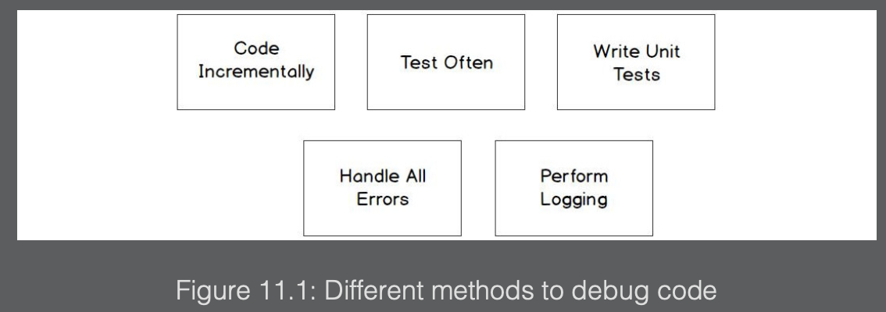
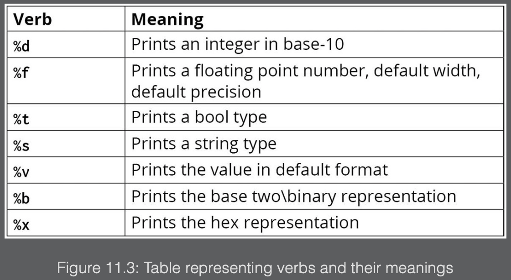

The process of determining the cause of unintended behavior is called debugging. There are various causes of bugs that get released into production:

- <b>Testing is performed as an afterthought</b>: During the development life cycle, it is tempting to not perform testing incrementally. For instance, we are creating multiple functions for an application, and once we finish all the functions, they then get tested. A possibly better way of testing our code would be to test each function as we complete it. This is known as incrementally testing or delivering code in smaller chunks. This gives us better code stability. This is accomplished by testing a function to ensure it works before continuing to the next function. The function that we just completed could be used by other functions. If we do not test it before we continue, the other functions that use our function could be using a buggy function. Depending on the bug and the change to our function, it could impact other users of our function.
- <b>Application enhancements or changes to requirements</b>: Our code often changes between the development phase and when we release it to production. Once in production, we receive feedback from the users; the feedback could be additional requirements or even “enhancements to the code. Changing the production-level code in one area could have a negative impact on another area. If the development team uses unit tests, then this would aid in mitigating some of the bugs introduced in a change to the code base. By using unit tests, we could run our unit test before we deliver the code to see whether our change had a negative impact.
- <b>Unrealistic development timeframe</b>: There are times when functionality is requested to be delivered in very tight timeframes. This can lead to taking shortcuts in best practices, shortening the design phase, performing less testing, and receiving unclear requirements. All of those can increase the chance of introducing bugs.
- <b>Unhandled errors</b>: Some developers may choose not to handle errors as they occur; for example, a file that is needed for the application to load configuration data is not found, not handling an error return for an invalid mathematical operation such as dividing by zero, or perhaps a connection to a server could not be established. If your program does not properly handle these and other types of errors, this can cause bugs.



---

## Formatting using `fmt`

One of the uses of the fmt package is to display data to the console or to the filesystem, such as a text file, that will contain information that could be helpful in debugging the code.

We have used the `fmt.Println()` function on numerous occasions.

The `fmt.Println()` function places spaces between arguments passed to the function and then appends a newline character at the end of the string.
Each type in Go has a default way that it is formatted when printed.

For example, strings are printed as they are, and integers are printed in decimal format. The `fmt.Println()` function prints the default formats of arguments.

---

### Formatting using `fmt.Printf()`

`fmt.Printf()` formats the string according to the verb and prints it to `stdout`. The `standard output (stdout)` is a stream for output. By default, the standard output is pointed to the terminal. The function uses something called format verbs, sometimes called a format specifier. The verbs tell the fmt function where to insert the variable.


The `fmt.Printf()` function does not add a new line to the end of the string that it prints. We must add a newline character in the string if we want to return the output with a new line:

```go
package main

import (
    "fmt"
)

func main() {
    fname := "Edward"
    lname := "Scissorhands"
    fmt.Printf("Hello my first name is %s\n", fname)
    fmt.Printf("Hello my last name is %s", lname)
}
```

In Go, you can escape characters using `\`. If you ever wanted to print the `\` character, then you’d put `fmt.Println("\\")` to escape the character. This tells us that a character should not be printed because it has a special meaning. When you use `\n`, it denotes a newline. We can place a newline anywhere within the string.

The Go language has several printing verbs. We will introduce some basic verbs that are frequently used.


