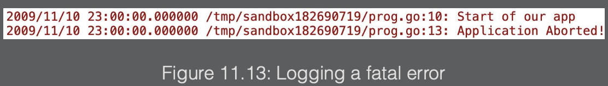

The process of determining the cause of unintended behavior is called debugging. There are various causes of bugs that get released into production:

- <b>Testing is performed as an afterthought</b>: During the development life cycle, it is tempting to not perform testing incrementally. For instance, we are creating multiple functions for an application, and once we finish all the functions, they then get tested. A possibly better way of testing our code would be to test each function as we complete it. This is known as incrementally testing or delivering code in smaller chunks. This gives us better code stability. This is accomplished by testing a function to ensure it works before continuing to the next function. The function that we just completed could be used by other functions. If we do not test it before we continue, the other functions that use our function could be using a buggy function. Depending on the bug and the change to our function, it could impact other users of our function.
- <b>Application enhancements or changes to requirements</b>: Our code often changes between the development phase and when we release it to production. Once in production, we receive feedback from the users; the feedback could be additional requirements or even “enhancements to the code. Changing the production-level code in one area could have a negative impact on another area. If the development team uses unit tests, then this would aid in mitigating some of the bugs introduced in a change to the code base. By using unit tests, we could run our unit test before we deliver the code to see whether our change had a negative impact.
- <b>Unrealistic development timeframe</b>: There are times when functionality is requested to be delivered in very tight timeframes. This can lead to taking shortcuts in best practices, shortening the design phase, performing less testing, and receiving unclear requirements. All of those can increase the chance of introducing bugs.
- <b>Unhandled errors</b>: Some developers may choose not to handle errors as they occur; for example, a file that is needed for the application to load configuration data is not found, not handling an error return for an invalid mathematical operation such as dividing by zero, or perhaps a connection to a server could not be established. If your program does not properly handle these and other types of errors, this can cause bugs.


---

## Formatting using `fmt`

One of the uses of the fmt package is to display data to the console or to the filesystem, such as a text file, that will contain information that could be helpful in debugging the code.

We have used the `fmt.Println()` function on numerous occasions.

The `fmt.Println()` function places spaces between arguments passed to the function and then appends a newline character at the end of the string.
Each type in Go has a default way that it is formatted when printed.

For example, strings are printed as they are, and integers are printed in decimal format. The `fmt.Println()` function prints the default formats of arguments.

---

### Formatting using `fmt.Printf()`

`fmt.Printf()` formats the string according to the verb and prints it to `stdout`. The `standard output (stdout)` is a stream for output. By default, the standard output is pointed to the terminal. The function uses something called format verbs, sometimes called a format specifier. The verbs tell the fmt function where to insert the variable.


The `fmt.Printf()` function does not add a new line to the end of the string that it prints. We must add a newline character in the string if we want to return the output with a new line:

```go
package main

import (
    "fmt"
)

func main() {
    fname := "Edward"
    lname := "Scissorhands"
    fmt.Printf("Hello my first name is %s\n", fname)
    fmt.Printf("Hello my last name is %s", lname)
}
```

In Go, you can escape characters using `\`. If you ever wanted to print the `\` character, then you’d put `fmt.Println("\\")` to escape the character. This tells us that a character should not be printed because it has a special meaning. When you use `\n`, it denotes a newline. We can place a newline anywhere within the string.

The Go language has several printing verbs. We will introduce some basic verbs that are frequently used.


---

### Basic debugging

There is some basic debugging that we can perform to aid us in remediating or, at the very least, gathering information about these bugs:

- <b>Printing out code markers in the code</b>:
  Markers in our code are print statements that help us to identify where we are in the program when the bug occurred:

  ```go
  fmt.Println("We are in function calculateGPA")
  ```

- <b>Printing out the type of the variable</b>: While debugging, it might be useful to know the variable type that we are evaluating:

  ```go
  fmt.Printf("fname is of type %T\n", fname)
  ```

- <b>Printing out the value of the variable</b>: Along with knowing the type of the variable, it is sometimes valuable to know the value that is stored in the variable:

  ```go
  fmt.Printf("fname value %#v\n", fname)
  ```

- <b>Performing debug logging</b>: At times, it might be necessary to print debug statements to a file: maybe there is an error that only occurs in a production environment, or perhaps we would like to compare the results of data printed in a file for different inputs to our code. This log-formatted message adjusting the message from the standard logger can help in this case:

  ```go
  log.Printf("fname value %#v\n", fname)
  ```


One of the first steps in debugging is to identify the general location of where the bug is in the code. Before you can start to analyze any data, we need to know where this bug is occurring. We do this by printing out markers in our code. Markers in our code are typically nothing more than print statements that help us to identify where we were in the program when the bug occurred. They are also used to narrow the scope of the location of the bug. Generally, this process involves placing a print statement with a message that shows us where we are in the code.

---

### Printing Go variable types

Go provides this functionality through the use of a `%T` verb. Go is case-sensitive. A capital `%T` means the type of the variable, and a lowercase `%t` means the bool type:

```go
package main

import (
    "fmt"
)

type person struct {
    lname string
    age int
    salary float64
}

func main() {
    fname := "Joe"
    grades := []int{100, 87, 67}
    states := map[string]string{"KY": "Kentucky", "WV": "West Virginia", "VA": "Virginia"}
    p := person{lname:"Lincoln", age:210, salary: 25000.00}
    fmt.Printf("fname is of type %T\n", fname)
    fmt.Printf("grades is of type %T\n", grades)
    fmt.Printf("states is of type %T\n", states)
    fmt.Printf("p is of type %T\n", p)
}
```

Here are the results of the preceding code snippet:

```
fname is of type string
grades is of type []int
states is of type map[string]string
p is of type main.person
```

The `%T` verb is used in each print statement to print the concrete type of the variable.

We can also print out a Go syntax representation of the type using `%#v`. It is useful to be able to print out the Go representation of a variable.


---

### Logging

Operating systems log various information such as access to resources, what an application is doing, the overall health of the system, and much more. It is not doing this because there is an error; rather, it is logging to make it easier for the system administrator to determine what is going on with the operating system at various times.

It allows for easier debugging when the operating system acts in an unusual way or performs a certain task that was not expected. This is the same attitude we should take when logging our application.

Logging is useful for understanding events that happen, the health of the application, any potential issues, and who is accessing our application or data. Logging is an infrastructure to your program that can be utilized when an abnormality occurs in the application. Logging helps us to track abnormalities that we would otherwise miss.

The Go standard library provides a package called log. It includes basic logging that can be used by our programs.

```go
package main

import (
    "log"
)

func main() {
    name := "Thanos"
    log.Println("Demo app")
    log.Printf("%s is here!", name)
    log.Print("Run")
}
```

The `Println()`, `Printf()`, and `Print()` log functions perform the same functionality as their fmt counterparts, with one exception. When the log functions execute, it gives additional details such as the date and time of the execution, as follows:

```
2019/11/10 23:00:00 Demo app
2019/11/10 23:00:00 Thanos is here!
2019/11/10 23:00:00 Run
```

This information can be useful when investigating and reviewing the logs later and for understanding the order of events. We can even get more details to be logged by our logger. The Go log package has a `SetFlags` function that allows us to be more specific.


Let’s set some of the flags in Figure 11.11 and observe the difference in behavior from what we had before.
Consider the following example:

```go
package main

import (
    "log"
)

func main() {
    log.SetFlags(log.Ldate | log.Lmicroseconds | log.Llongfile)
    name := "Thanos"
    log.Println("Demo app")
    log.Printf("%s is here!", name)
    log.Print("Run")
}
```

- `log.Ldate` is the date of the local time zone. This is the same information that was logged before.
- `log.Lmicroseconds` will give the microseconds of the formatted date.
- `log.LlongFile` will give us the full filename and line number that the log comes from.


---

### Logging fatal errors

Using the log package, we can also log fatal errors.

The `Fatal()`, `Fatalf()`, and `Fatalln()` functions are similar to `Print()`, `Printf()`, and `Println()`. The difference is after logging, `Fatal()` functions are followed by an `os.Exit(1)` system call.

The log package also has the following functions: `Panic`, `Panicf`, and `Panicln`. The difference between the Panic functions and the Fatal functions is that the Panic functions are recoverable. When using the Panic functions, you can use the `defer()` function, whereas when using the Fatal functions, you cannot. The Fatal functions call `os.Exit()`; a defer function will not be called when `os.Exit()` gets called.

There may be some instances where you want to abort the program immediately with no possibility of recovery. For example, the application may have gotten to a state where it is best to exit it before data corruption or undesired behavior results. Or, you may have developed a command-line utility that is used by others and you need to provide an exit code to the callers of your executable to signal it has completed its tasks.

In the following code example, we will look at how log.Fataln is used:

```go
package main

import (
    "log"
    "errors"
)

func main() {
    log.SetFlags(log.Ldate | log.Lmicroseconds | log.Llongfile)
    log.Println("Start of our app")
    err := errors.New("Application Aborted!")
    if err != nil {
        log.Fatalln(err)
    }
    log.Println("End of our app")
}
```

Let’s break down the code to understand it better:

```go
log.Println("Start of our app")
```

The statement prints to stdout with the date, time, and line number of the log message:

```go
err := errors.New("We crashed!")”
```

We create an error to test the logging of Fatal() errors:

```go
log.Fatalln(err)
```

We log the error, and then it exits the program:

```go
log.Println("End of our app")
```

The line did not execute because we logged the error as fatal, and that caused the program to exit.


---

### Debugging in live or restricted environments

To best debug in those kinds of environments, you should consider the following points:

- <b>Understand the environment</b>: Before diving into debugging, take a step back. Understand the deployment setup, network configurations, and any security constraints. This information helps to anticipate potential issues and streamline debugging.
- <b>Remote debugging with proper tools</b>: `Delve` is a powerful debugger for Go that supports remote debugging. By using `Delve`, you can connect to a running Go process and inspect variables, set breakpoints, and step through code. This is an invaluable debugging tool.
- <b>Observability of the code</b>: Go’s built-in profiling tools, such as `pprof`, allow you to gather runtime statistics and profile your application’s performance. By exposing a profiling endpoint in your code, you can collect data from live systems without modifying the code after it’s deployed. The same can be said if you add metrics and additional observability to your application. There are also tools available to capture application logs and aggregate them to be searchable in the future. This provides additional context that can assist the debugging process.
- <b>Utilize log levels</b>: Utilizing the different log levels available in the language is useful in different environments. However, you should be cautious to not over-share information via logging – especially in the event of dealing with private data.
- <b>Set up integrated development environment (IDE) debuggers</b>: Modern IDEs such as Visual Studio Code or JetBrains GoLand provide robust debugging capabilities. You can use breakpoints, watch expressions, and walk-through code using your debugger in the IDE. This is extremely efficient in pinpointing problems but is not something you can do in every deployment environment.
- <b>Feature flags and canary releases</b>: Leveraging feature flags and/or canary releases enables you to selectively enable or disable specific functionalities in production. By gradually rolling out changes, you can observe the impact on a subset of users. This makes it easier to identify and address issues before a widespread release.
