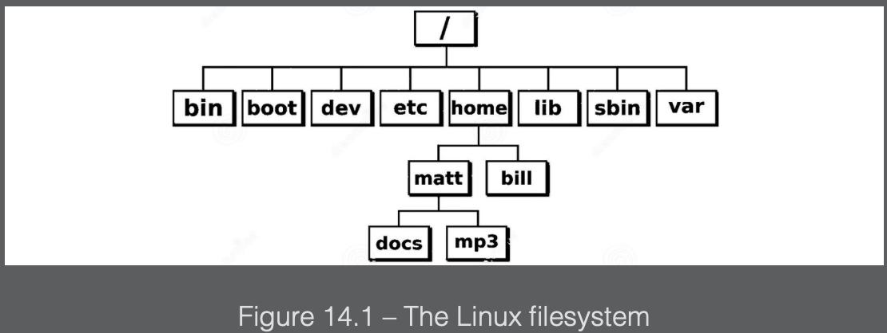
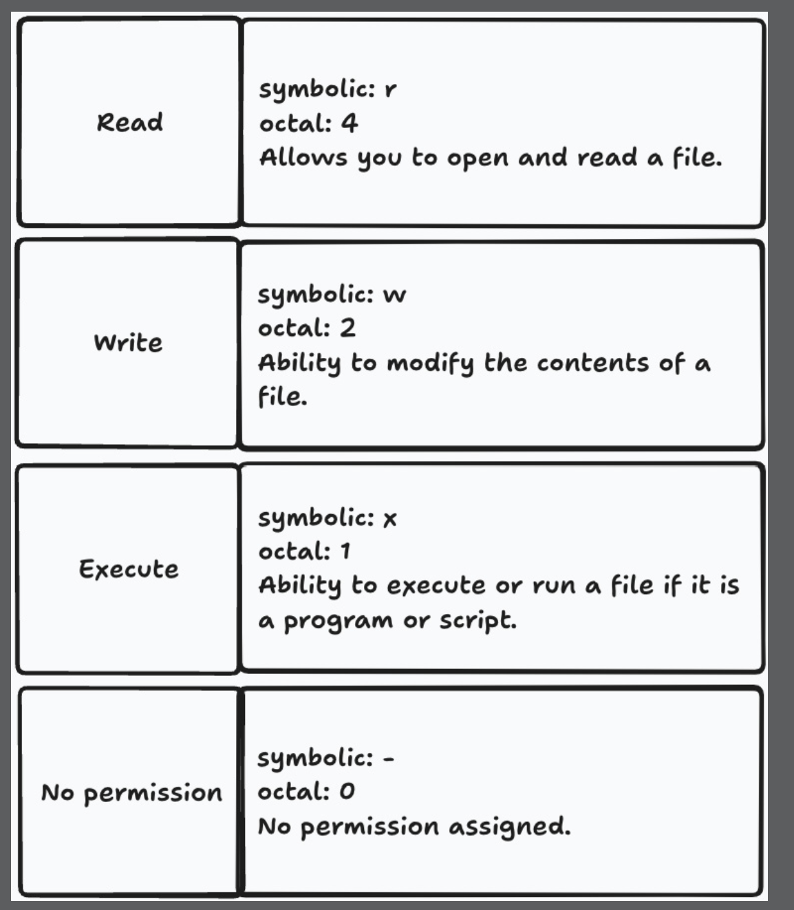
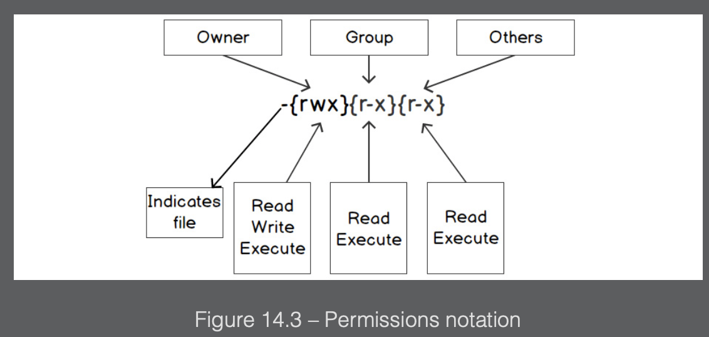
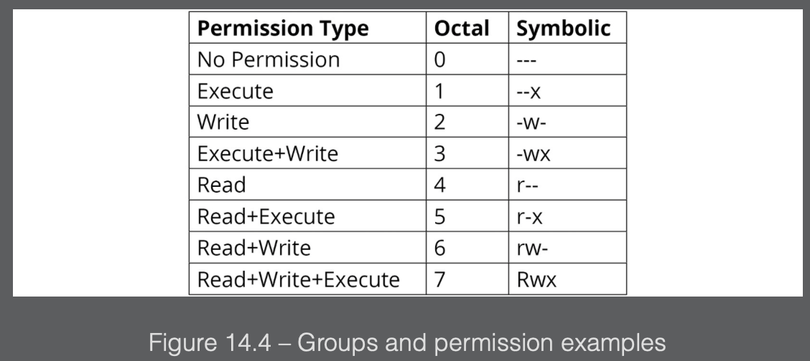
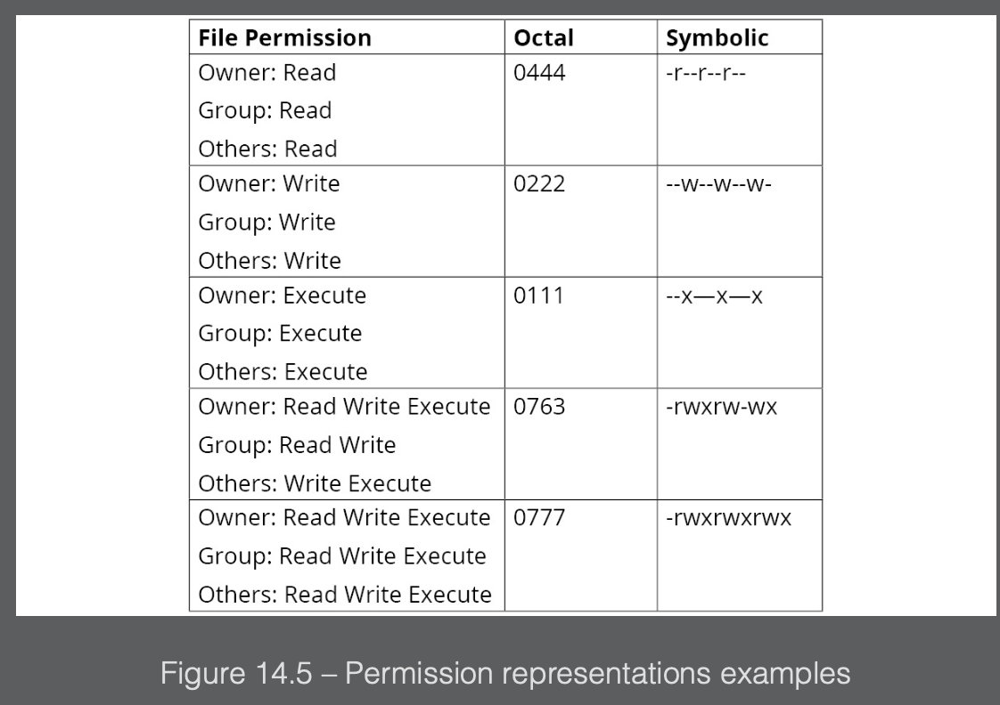

## Overview

We will see in this chapter how to interact with the filesystem, which means we will read files, manipulate them, store them for later use, and get information about them. We will also cover how to read folders so that we can search for the files we need, and will examine some specific file formats such as CSV, which is commonly used to share information in tabular form.

Excerpt From: Samantha Coyle. “Go Programming - From Beginner to Professional.” Apple Books.

---

### Filesystem

A filesystem controls how data is named, stored, accessed, and retrieved on a device such as a hard drive, USB, DVD, or another medium. There is no one filesystem, and how it behaves largely depends on what OS you are using.

You must have heard of FAT, FAT32, NFTS, and so on, which are all different filesystems and are used normally by Windows. Linux can read and write to them, but it generally uses a different family of filesystems that have names starting with ext, which stands for extended.

Each filesystem has its conventions for naming files, such as the length of the filename, the specific characters that can be used, how long the suffix or file extension can be, and so on. Each file has information or metadata, data embedded within a file or associated with it that describes or provides information about the file. This metadata about a file can contain information such as file size, location, access permissions, date created, date modified, and more. This is all the information that can be accessed by our applications.

Files are generally placed in some sort of hierarchal structure. This structure typically consists of multiple directories and sub-directories. The placement of the files within the directories is a way to organize your data and get access to the file or directory:


---

### File permissions

Permissions are an important aspect that you need to understand when dealing with file creation and modifications.

We need to look at various permission types that can be assigned to a file. We also need to consider how those permission types are represented in symbolic and octal notation.

Go uses the Unix nomenclature to represent permission types. They are represented in symbolic notation or octal notation. The 3 permission types are `Read`, `Write`, and `Execute`.


Permissions for every file are assigned to 3 different entities that can be individuals or groups. This means that a user can be part of a group that has access to some files, as a result of which the user inherits access to those files.

It is not possible to assign permissions for a file to a specific user; rather, we add the user to a group and then assign permissions to that group. That said, it is possible to assign permission for a file to the following:

- `Owner`: This is an individual, a single person such as John Smith, or the root user who is the owner of the file. In general, it is the individual who created the file.
- `Group`: A group typically consists of multiple individuals or other groups.
- `Others`: Those that are not in a group or the owner.

Let’s see now, how permissions are indicated via symbolic notation. The following diagram is an example of a file and its permissions on a Unix machine:


The 1st dash (-) in the figure above means that the entity is a file. If it was a directory, it would have been the character `d` instead.

Another way to specify the permissions is the octal notation, which expresses multiple permissions types with a single number.

For example, if you want to indicate read and write permissions using symbolic notation, it would be `rw-`. If this was to be represented as an octal number, it would be `6`, because `4` means read permission and `2` means write permission. Full permission would be `7`, which means `4+2+1` or `read+write+execute` (`rwx`).



Each permission can be expressed with a number `<=7`, which is in one digit. Permissions for owner, group, and others can then be expressed in octal notation with three digits, as we can see in the following:


In octal representation all numbers start with a `0`. When working with the filesystem via the command line you can omit the leading zero. However, in many cases, when programming, you need to pass it so that the compiler will understand that you are writing something in octal notation. You might argue that `0777` and `777` are the same number, but the leading zero is just a convention that tells the compiler that you are using an octal notation and the number is octal and not decimal. In other words, `777` is interpreted as the decimal number `777`, while `0777` is interpreted as the octal number `0777`, which is the decimal number `511`.

---

### Flags and arguments

Go provides support for creating command-line interface tools. Often, when we write Go programs that are executables, they need to accept various inputs.

These inputs could include the location of a file, a value to run the program in the debug state, getting help to run the program and more. All of this is made possible by a package in the Go standard library called `flag`. It is used to allow the passing of arguments to the program. A flag is an argument that is passed to a Go program. The order of the flags being passed to the Go program using the `flag` package does not matter to Go.

To define your flag, you must know the flag type you will be accepting. The flag package provides many functions for defining flags. Here is a sample list:

```go
func Bool(name string, value bool, usage string) *bool
func Duration(name string, value time.Duration, usage string) *time.Duration
func Float64(name string, value float64, usage string) *float64
func Int(name string, value int, usage string) *int
func Int64(name string, value int64, usage string) \*int64
```

These are some of the functions allowing you to create flags and accept parameters, and there is one for each default type in Go.
The parameters of the preceding functions can be explained as follows:

- `name`: This parameter is the name of the flag; it is a string type. For example, if you pass file as an argument, you would access that flag from the command line with the following:

  ```
  ./app -file
  ```

- `value`: This parameter is the default value that the flag is set to.
  usage: This parameter is used to describe the flag’s purpose. It will often show up on the command line when you incorrectly set the value. Passing the wrong type for a flag will stop the program and cause an error; the usage will be printed.
- `return value`: This is the address of the variable that stores the value of the flag.

There is another way, however, to define these flags. It can be done using the following functions:

```go
func BoolVar(p *bool, name string, value bool, usage string)
func DurationVar(p *time.Duration, name string, value time.Duration, usage string)
func Float64Var(p *float64, name string, value float64, usage string)
func Int64Var(p *int64, name string, value int64, usage string)
func IntVar(p *int, name string, value int, usage string)”
```

As you can see, for each type, there is a function similar to those we’ve already seen, whose names end with Var. They all accept a pointer to the type of the flag as the first argument, and can be used as in the following code snippet:

```go
package main

import (
    "flag"
    "fmt"
)

func main() {
    var v int
    flag.IntVar(&v, "value", -1, "Needs a value for the flag.")
    flag.Parse()
    fmt.Println(v)
}
```

This code does the same as the previous snippet, however, here’s a quick breakdown:

- First, we define an integer variable v
- Use its reference as the first parameter of the IntVar function
- Parse the flags
- Print the v variable, which now does not need to be dereferenced as it is not the flag but an actual integer

If we compile our application, using any of the preceding snippets, as an executable called flagapp, with the following call in the same directory as the executable, we will see that it will print the number 5:

```
flagapp -value=5
```

If we call it without the parameter with the following call in the same directory as the executable, we will see that it will just print -1:

```
flagapp
```

This is because -1 is the default value.
