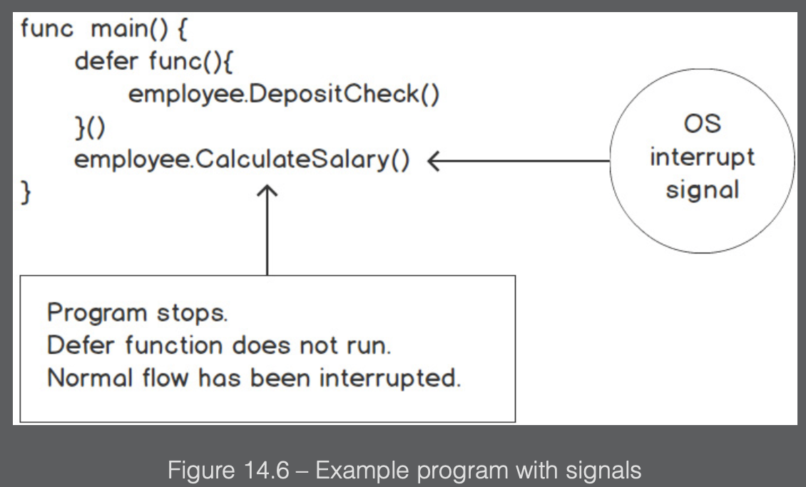

## Overview

We will see in this chapter how to interact with the filesystem, which means we will read files, manipulate them, store them for later use, and get information about them. We will also cover how to read folders so that we can search for the files we need, and will examine some specific file formats such as CSV, which is commonly used to share information in tabular form.

Excerpt From: Samantha Coyle. “Go Programming - From Beginner to Professional.” Apple Books.

---

### Filesystem

A filesystem controls how data is named, stored, accessed, and retrieved on a device such as a hard drive, USB, DVD, or another medium. There is no one filesystem, and how it behaves largely depends on what OS you are using.

You must have heard of FAT, FAT32, NFTS, and so on, which are all different filesystems and are used normally by Windows. Linux can read and write to them, but it generally uses a different family of filesystems that have names starting with ext, which stands for extended.

Each filesystem has its conventions for naming files, such as the length of the filename, the specific characters that can be used, how long the suffix or file extension can be, and so on. Each file has information or metadata, data embedded within a file or associated with it that describes or provides information about the file. This metadata about a file can contain information such as file size, location, access permissions, date created, date modified, and more. This is all the information that can be accessed by our applications.

Files are generally placed in some sort of hierarchal structure. This structure typically consists of multiple directories and sub-directories. The placement of the files within the directories is a way to organize your data and get access to the file or directory:


---

### File permissions

Permissions are an important aspect that you need to understand when dealing with file creation and modifications.

We need to look at various permission types that can be assigned to a file. We also need to consider how those permission types are represented in symbolic and octal notation.

Go uses the Unix nomenclature to represent permission types. They are represented in symbolic notation or octal notation. The 3 permission types are `Read`, `Write`, and `Execute`.


Permissions for every file are assigned to 3 different entities that can be individuals or groups. This means that a user can be part of a group that has access to some files, as a result of which the user inherits access to those files.

It is not possible to assign permissions for a file to a specific user; rather, we add the user to a group and then assign permissions to that group. That said, it is possible to assign permission for a file to the following:

- `Owner`: This is an individual, a single person such as John Smith, or the root user who is the owner of the file. In general, it is the individual who created the file.
- `Group`: A group typically consists of multiple individuals or other groups.
- `Others`: Those that are not in a group or the owner.

Let’s see now, how permissions are indicated via symbolic notation. The following diagram is an example of a file and its permissions on a Unix machine:


The 1st dash (-) in the figure above means that the entity is a file. If it was a directory, it would have been the character `d` instead.

Another way to specify the permissions is the octal notation, which expresses multiple permissions types with a single number.

For example, if you want to indicate read and write permissions using symbolic notation, it would be `rw-`. If this was to be represented as an octal number, it would be `6`, because `4` means read permission and `2` means write permission. Full permission would be `7`, which means `4+2+1` or `read+write+execute` (`rwx`).


Each permission can be expressed with a number `<=7`, which is in one digit. Permissions for owner, group, and others can then be expressed in octal notation with three digits, as we can see in the following:


In octal representation all numbers start with a `0`. When working with the filesystem via the command line you can omit the leading zero. However, in many cases, when programming, you need to pass it so that the compiler will understand that you are writing something in octal notation. You might argue that `0777` and `777` are the same number, but the leading zero is just a convention that tells the compiler that you are using an octal notation and the number is octal and not decimal. In other words, `777` is interpreted as the decimal number `777`, while `0777` is interpreted as the octal number `0777`, which is the decimal number `511`.

---

### Flags and arguments

Go provides support for creating command-line interface tools. Often, when we write Go programs that are executables, they need to accept various inputs.

These inputs could include the location of a file, a value to run the program in the debug state, getting help to run the program and more. All of this is made possible by a package in the Go standard library called `flag`. It is used to allow the passing of arguments to the program. A flag is an argument that is passed to a Go program. The order of the flags being passed to the Go program using the `flag` package does not matter to Go.

To define your flag, you must know the flag type you will be accepting. The flag package provides many functions for defining flags. Here is a sample list:

```go
func Bool(name string, value bool, usage string) *bool
func Duration(name string, value time.Duration, usage string) *time.Duration
func Float64(name string, value float64, usage string) *float64
func Int(name string, value int, usage string) *int
func Int64(name string, value int64, usage string) \*int64
```

These are some of the functions allowing you to create flags and accept parameters, and there is one for each default type in Go.
The parameters of the preceding functions can be explained as follows:

- `name`: This parameter is the name of the flag; it is a string type. For example, if you pass file as an argument, you would access that flag from the command line with the following:

  ```
  ./app -file
  ```

- `value`: This parameter is the default value that the flag is set to.
  usage: This parameter is used to describe the flag’s purpose. It will often show up on the command line when you incorrectly set the value. Passing the wrong type for a flag will stop the program and cause an error; the usage will be printed.
- `return value`: This is the address of the variable that stores the value of the flag.

There is another way, however, to define these flags. It can be done using the following functions:

```go
func BoolVar(p *bool, name string, value bool, usage string)
func DurationVar(p *time.Duration, name string, value time.Duration, usage string)
func Float64Var(p *float64, name string, value float64, usage string)
func Int64Var(p *int64, name string, value int64, usage string)
func IntVar(p *int, name string, value int, usage string)”
```

As you can see, for each type, there is a function similar to those we’ve already seen, whose names end with Var. They all accept a pointer to the type of the flag as the first argument, and can be used as in the following code snippet:

```go
package main

import (
    "flag"
    "fmt"
)

func main() {
    var v int
    flag.IntVar(&v, "value", -1, "Needs a value for the flag.")
    flag.Parse()
    fmt.Println(v)
}
```

This code does the same as the previous snippet, however, here’s a quick breakdown:

- First, we define an integer variable v
- Use its reference as the first parameter of the IntVar function
- Parse the flags
- Print the v variable, which now does not need to be dereferenced as it is not the flag but an actual integer

If we compile our application, using any of the preceding snippets, as an executable called flagapp, with the following call in the same directory as the executable, we will see that it will print the number 5:

```
flagapp -value=5
```

If we call it without the parameter with the following call in the same directory as the executable, we will see that it will just print -1:

```
flagapp
```

This is because -1 is the default value.

---

### Signals

A signal is an interrupt that is sent to our program or a process by the OS. When a signal is delivered to our program, the program will stop what it is doing; either it will handle the signal or, if possible, ignore it.

The following is a list of the top 3 most often used interrupt signals for Go programs:

- `SIGINT` (interrupt):

  - `Situation`: This signal is commonly used when a user presses `Ctrl + C` in the terminal to interrupt the execution of a program.
  - `Definition`: `SIGINT` is the interrupt signal. It is used to gracefully terminate a program and perform cleanup operations before exiting.

- `SIGTERM` (termination):

  - `Situation`: This signal is often used to request the termination of a program in a controlled manner. It is a generic signal to terminate a process.
  - `Definition`: `SIGTERM` is the termination signal. It allows a program to perform cleanup operations before exiting, similar to `SIGINT`, but it can be caught and handled differently.

- `SIGKILL` (kill):

  - `Situation`: This signal is used to forcefully terminate a program. It doesn’t allow the program to perform any cleanup operations.
  - `Definition`: `SIGKILL` is the kill signal. It immediately terminates a process without giving it a chance to clean up resources. It is a more forceful way of ending a program compared to `SIGTERM`.

We use `defer` statements in our applications to perform various cleanup activities, such as the following:

- The release of resources
- The closing of files
- The closing of database connections
- Performing the removal of configuration or temporary files

In some use cases, it is important that these activities are completed. Using a `defer` function will execute it just before returning to the caller. However, this does not guarantee that it will always run. There are certain scenarios in which the defer function won’t execute; for example, an OS interrupt to your program:

- os.Exit(1)
- Ctrl + C
- Other instructions from the OS

The preceding scenarios indicate where it may warrant using signals. Signals can help us control the exit of our program. Depending on the signal, it could terminate our program. For example, the application is running and encounters an OS interrupt signal after executing `employee.CalculateSalary()`. In this scenario, the defer function will not run, thus, `employee.DepositCheck()` does not execute and the employee does not get paid. A signal can change the flow of the program.



Support for handling signals is built into the Go standard library; it is in the `os/signal` package. This package will allow us to make our programs more resilient. We want to gracefully shut down when we receive certain signals. The first thing to do when handling signals in Go is to trap or catch the signal that you are interested in. This is done by using the following function:

```go
func Notify(c chan<- os.Signal, sig ...os.Signal)”
```

This function accepts an os.Signal data type on a channel, c. The sig argument is a variadic variable of os.Signal; we specify zero or more os.Signal data types that we are interested in. Let’s see a code snippet showing how we can use this function to stop the execution of an application:

```go
package main

import (
    "fmt"
    "os"
    "os/signal"
    "syscall"
)

func main() {
    sigs := make(chan os.Signal, 1)
    done := make(chan struct{})
    signal.Notify(sigs,syscall.SIGINT)
    go func() {
    for {
        s := <-sigs
        switch s {
            case syscall.SIGINT:
                fmt.Println()
                fmt.Println("My process has been interrupted. Someone might of pressed CTRL-C")
                fmt.Println("Some clean up is occuring")
                done <-struct{}{}
            }
        }
    }()
    fmt.Println("Program is blocked until a signal is caught")
    done <- struct{}{}
    fmt.Println("Out of here")
}
```

After the definition of the package and importing the packages, we do the following:

- Define a channel to send signals
- Define a channel that we can use as a flag to stop the execution
- Use `Notify` to send a `SIGINT` signal
- Create a goroutine that listens indefinitely to signals and if the signal is `SIGINT`, it does some printouts and sends a message to the done channel with the true value
- Print a message stating we are waiting for the done message to be received
- Wait for the done message
- Print the final message

When we run the application, we will actually see the application terminate quite quickly, because we manually send the SIGINT signal. In a real-world scenario, the application would just wait for the `SIGKILL` signal, which we can manually send with `Ctrl + X`.

---

### Create and write to files

The `os` package provides a simple way in which to create a file. For those who are familiar with the touch command from the Unix world, it is similar to this. Here is the signature of the function:

```go
func Create(name string(*File, error)
```

The function will create an empty file much as the `touch` command does. It is important to note that if the file already exists, then it will truncate the file.

The `os` package’s `Create` function has an input parameter, which is the name of the file to create and its location. If successful, it will return a `File` type. It is worth noting that the File type satisfies the `io.Write` and `io.Read` interfaces.

```go
package main

import (
    "os"
)

func main() {
    f, err := os.Create("test.txt")
    if err != nil {
        panic(err)
    }
    defer f.Close()
}
```

The preceding code simply defines the imports and then, in the main function, tries to create a file called `test.txt`. If there is an error as a result, it panics. The last line before the closing brackets makes sure that whenever the application is interrupted, either because it terminates successfully or it panics, the file will be closed. We want to make sure we never keep files in an open state.

Creating an empty file is straightforward, but let’s continue with `os.Create` and write to the file we just created. Recall that `os.Create` returns an `\*os`.File type. There are 2 methods of interest that can be used to write to the file:

package main
import (
    "os"
)
func main() {
    f, err := os.Create("test.txt")
    if err != nil {
        panic(err)
“
    defer f.Close()
}
The preceding code simply defines the imports and then, in the main function, tries to create a file called test.txt. If there is an error as a result, it panics. The last line before the closing brackets makes sure that whenever the application is interrupted, either because it terminates successfully or it panics, the file will be closed. We want to make sure we never keep files in an open state.
Creating an empty file is straightforward, but let’s continue with os.Create and write to the file we just created. Recall that os.Create returns an \*os.File type. There are 2 methods of interest that can be used to write to the file:

- Write
- WriteString

```go
package main

import (
    "os"
)

func main() {
    f, err := os.Create("test.txt")
    if err != nil {
        panic(err)
    }
    defer f.Close()
    f.Write([]byte("Using Write function.\n"))
    f.WriteString("Using Writestring function.\n")
}
```

We can, however, use the package to write to the file directly without having to open it first. We can do this using the `os.WriteFile` function:

```go
func WriteFile(filename string, data []byte, perm os.FileMode) error
```

The method writes the data to the file specified in the filename parameter, with the given permissions. It will return an error if one exists. Let’s take a look at this in action:

```go
package main

import (
    "fmt"
    "os
)

func main() {
    message := []byte("Look!")
    err := os.WriteFile("test.txt", message, 0644)
    if err != nil {
        fmt.Println(err)
    }
}
```

As we can see, we can create a file, send a string transformed into a slice of bytes, and assign the permission to it, all in one line. It is important to also send the permission level and note that we need to use the octal notation with the leading zero (this is because without the leading zero, the permission will not work as expected).
One important thing that we haven’t seen till now is how to check whether a file exists or not. This is important because if a file does exist, we might not want to truncate it and override it with new content. Let’s see how we can do that:

```go
package main

import (
    "fmt"
    "s"
    "flag"
)

func main() {
    var name tring
    flag.StringVar(&name, "name", "", "File name")
    flag.Parse()
    file, err := os.Stat(name)
    if err != nil {
        if os.IsNotExist(err) {
            fmt.Printf("%s: File does not exist!\n", name)
            fmt.Println(file)
            return
        }
        fmt.Println(err)
        return
      }
    fmt.Printf("file name: %s\nIsDir: %t\nModTime: %v\nMode: %v\nSize: %d\n", file.Name(),
    file.IsDir(), file.ModTime(), file.Mode(), file.Size())
}
```

---

### Reading the whole file at once

These 2 functions are good to use when your file size is small. While these 2 methods are convenient and easy to use, they have one major drawback. That is, if the file size is too large, then it could exhaust the memory available on the system. It is important to keep this in mind and understand the limitations of the 2 methods we will be going over in this topic. Even though these methods are some of the quickest and easiest ways to load data, it is important to understand that they should be limited to small files and not large ones.

The method’s signature is as follows:

```go
func ReadFile(filename string) ([]byte, error)
```

The `ReadFile` function reads the contents of the file and returns it as a slice of bytes along with any reported errors. We will look at the error return when the `ReadFile` method is used:

- A successful call returns err == nil.
- In some of the other read methods for files, end of file (`EOF`) is treated as an error. This is not the case for functions that read the entire file into memory.

```go
package main

import (
    "fmt"
    "os"
)

func main() {
    content, err := os.ReadFile("test.txt")
    if err != nil {
        fmt.Println(err)
    }
    fmt.Println("File contents: ")
    fmt.Println(string(content))
}
```

As we can see, what we do in this code is as follows:

- We do our imports
- We read the contents of the whole `test.txt` file
- We print an error if it occurs
- Else, we print the content of the file:

  ```go
  fmt.Println("File contents: ")
  fmt.Println(string(content))
  ```

As the content is retrieved as a slice of bytes, we need to convert it to a string to visualize it. Let’s see how to read, instead, the file character by character in the next snippet:

package main

import (
    "fmt”
“
    }
    fmt.Println("File contents: ")
    fmt.Println(string(content))
}
As we can see, what we do in this code is as follows:
We do our imports
We read the contents of the whole test.txt file
We print an error if it occurs
Else, we print the content of the file:

fmt.Println("File contents: ")
  fmt.Println(string(content))
As the content is retrieved as a slice of bytes, we need to convert it to a string to visualize it. Let’s see how to read, instead, the file character by character in the next snippet:

```go
package main

import (
    "fmt"
    "io"
    "log"
    "os"
)

func main() {
    f, err := os.Open("test.txt")
    if err != nil {
        log.Fatalf("unable to read file: %v", err)
    }
    buf := make([]byte, 1)
    for {
        n, err := f.Read(buf)
        if err == io.EOF {
            break
        }
        if err != nil {
            fmt.Println(err)
            continue
        }
    if n > 0 {
            fmt.Print(string(buf[:n]))
    }
    }
}
```

1. Open the file using the `Open` function:

```go
f, err := os.Open("test.txt")
```

2. We check whether the error is `nil`, and if is not, we print the error and exit:

```go
if err != nil {
    log.Fatalf("unable to read file: %v", err)
}
```

3. We then create a slice of bytes of size 1:

```go
buf := make([]byte, 1)
```

4. We then make an infinite loop, and inside it, we read the file into the buffer:

```go
n, err := f.Read(buf)
```

5. We then check whether there is an error, which also means that we reached the end of the file, in which case we stop the loop:

```go
if err == io.EOF {
    break
}
```

6. If the error is not nil but is not end of file, we carry on with the loop, ignoring the error.

7. If there is no error and the content has been read, then we display the content:

```go
if n > 0 {
  fmt.Print(string(buf[:n]))
}
```

Notice that we read one character at a time, as we made a buffer (slice of bytes) of size one. This might be resource intensive, so you might change this value to any other value for your particular case and needs.

---

### CSV

One of the most common ways a file is structured is as a comma-separated value. This is a clear-text file that contains data, which is basically represented as rows and columns. Frequently, these files are used to exchange data. A CSV file has a simple structure. Each piece of data is separated by a comma and then a new line for another record.

An example of a CSV file is as follows:

```
firstName, lastName, age
Celina, Jones, 18
Cailyn, Henderson, 13
Cayden, Smith, 42
```

The Go programming language has a standard library that is used for handling CSV files: encoding/csv:

```go
package main

import (
    "encoding/csv"
    "fmt"
    "io"
    "log"
    "strings"
)

func main() {
    in := `firstName, lastName, age
Celina, Jones, 18
Cailyn, Henderson, 13
Cayden, Smith, 42
`
    r := csv.NewReader(strings.NewReader(in))
    for {
        record, err := r.Read()
        if err == io.EOF {
            break
        }
        if err != nil {
        log.Fatal(err)
        }
        fmt.Println(record)
    }
}
```

---

### Embedding

Often, you will need to present to the user some complex text, maybe an HTML page, and it might be impractical to define the whole file as a string.

You might want to display an image, again by opening and reading the file containing the image. One of the great features of Go is that even if you can build your application as a single binary, you will also have external dependencies that need to be distributed with your binary. Another issue is that reading from a file might be slow, so it would be great if we could embed files inside our Go application. This will allow us to just distribute one binary including all our assets. In the past, this required external libraries, but now Go includes a package called embed that allows you to easily embed any file into your binary so that you do not need to share other dependencies.

In the next snippet, we will create a very simple template file and will read and parse it. Then we will use it to display some greetings. Let’s start with the template. We need a folder structure like this: `embedding_example/main.go and templates/template.txt`.

The content of the template.txt file is Hello {{.Name}}, which is pretty simple. This simply means that when we use this template and pass a variable called Name, the engine will substitute the variable with anything we pass as a value.

Let’s see now how we can make use of this template written in an external file, without having to read it every time we run the application:

```go
package main

import (
    "embed"
    "os"
    "text/template"
)

type Person struct {
    Name string
}
var (
    //go:embed templates
    f embed.FS
)
func main() {
    p := Person{"John"}
    tmpl, err := template.ParseFS(f, "templates/template.txt")
    if err != nil {
        panic(err)
    }
    err = tmpl.Execute(os.Stdout, p)
    if err != nil {
        panic(err)
    }
}
```

1. We start importing all the necessary packages. After that, we define a struct called Person that will hold the name of the person to greet. The next part is the important bit:

```go
var (
    //go:embed templates
    f embed.FS
)
```

This defines an `f` variable of type embed.FS, which stands for embedded file system and will work as a virtual filesystem for us. The directive on top of the declaration needs to be just above the variable we define, otherwise the compiler will prompt us with an error. This directive tells the Go compiler that it needs to read and embed whatever is inside the templates folder and make it available. Be careful if you add a folder with too many big files, as your final binary will increase in size.

1. Inside the `main` function, we then instantiate a struct of type Person where the Name attribute has the value John.
2. After that, we use the ParseFS function of the template package, and we use it to read from the embedded file system, represented by the variable `f`, the file called `template.txt` from inside the templates folder.
3. Next, we just execute the templating engine, passing the previously created struct. If you run the application, you will see the message printed out as follows:

```
Hello John
```

4. Now, this does not seem much, but try running the following command:

```go
go build -o embtest main.go
```

5. Then, copy your executable to a different location where the template folder is not available. If you now run from that new folder, you will still see the exact same message:

```
./embtest
```

The key takeaway here is that the directive takes the whole filesystem from the point you specify, in this case, the templates folder, and creates a virtual filesystem. From this virtual filesystem, you can read all the files, but the content of the whole folder will actually be stored inside the final binary of your application. This feature is very powerful but should be used wisely, as the final binary could easily become very big.
