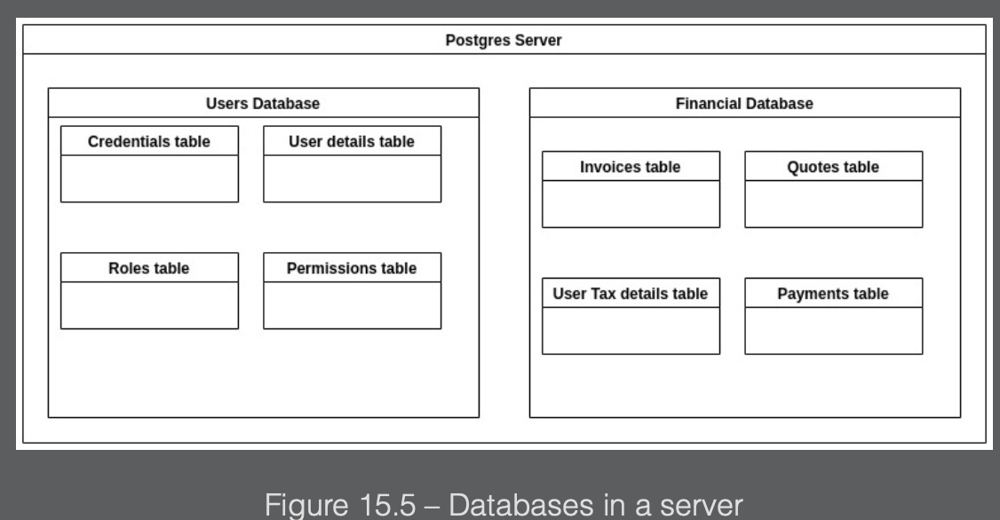

## Introduction

As a developer, it is impossible to get by without a proper understanding of persistent data storage and databases. Our applications process input and produce output, but most of the time, if not in all cases, a database is involved in the process.

This database can be in-memory (stored in the computer’s RAM) or file-based (a single file in a directory), and it can live on local or remote storage. A database engine can be installed locally, but it is also possible to use cloud providers, which allow you to use a database as a service; some of the cloud providers that offer several different database engine options are Azure, AWS, and Google Cloud.

---

### Connecting to databases

To connect to any database, we need at least 4 things to be in place:

- a host to connect to
- a database to connect to that is running on a port
- a username
- a password

The user needs to have appropriate privileges because we not only want to connect but we would like to perform specific operations, such as query, insert, or remove data, create or delete databases, and manage users and views.

In most cases, the database server supports multiple databases, and the databases hold one or more tables:



Imagine that the databases are logical containers that belong together.

---

### Create a new project

To connect, we need to get the appropriate module from GitHub, which needs internet connectivity. We need to issue the following command to get the package needed to interact with the Postgres instance:

```go
go get github.com/lib/pq
```

First, we will initialize our script:

```go
package main
import "fmt"
import "database/sql"
import _ "github.com/lib/pq"
// import _ <package name> is a special import statement that tells Go to import a package solely for its side effects.
```

Now that we have initialized our script, we can connect to our database:

```go
db, err := sql.Open("postgres", "user=postgres password=Start!123 host=127.0.0.1 port=5432 dbname=postgres sslmode=disable")
```

The API gives us an `Open()` function, which takes a variety of arguments.

- The `postgres` string, used as the first parameter in the `Open` function call, tells the function to use the Postgres driver to make the connection.
- The second argument is a so-called connection string, which holds the `user`, `password`, `host`, `port`, `dbname`, and `sslmode` arguments; these will be used to initialize the connection. In this example, we’re connecting to the local host marked by 127.0.0.1 on the default port of 5432, and we don’t use ssl. For production systems, people tend to change the default port and enforce encrypted traffic via ssl toward the database server; you should always follow the best practices concerning the type of database you’re working with.

The `Open()` function returns 2 values. One is for the database connection and the other is for the error, if one occurred during initialization.

We can check whether there were any errors by writing the following code:

```go
if err != nil {
  panic(err)
} else {
  fmt.Println("The connection to the DB was successfully initialized!")
}
```

The `panic()` function in Go is used to indicate that something went wrong unexpectedly, and we are not prepared to handle it gracefully, thus stopping the execution.

If the connection succeeds, we print out a message stating `The connection to the DB was successfully initialized!`. When you have a long-running application, it is worth incorporating a way to check whether the database is still reachable because due to intermittent network errors, you could lose the connection and fail to execute whatever you want to execute. This can be checked with the following small code snippet:

```go
connectivity := db.Ping()
if connectivity != nil{
  panic(err)
} else {
  fmt.Println("Good to go!")
}
```

You can run this check constantly on a different Go routine every few seconds. It will check if the database is on but also help keep the connection open; otherwise, it will go idle. This is a proactive solution as you check the status of the database connection.

In this case, we used the `panic()` function to indicate that the connection has been lost. Finally, once our job is done, we need to terminate our connection to the database to remove user sessions and free up resources. This can happen either if you are building a script that will run as a job, hence will run and finish, or if you are building a long-running service. In the first case, you can use the following command at the end of the script:

```go
db.Close()
```

This ensures that before terminating the script, the connection will be dropped. If you are building a long-running service, you don’t have a specific point in your code where you know that the script will terminate, but it can happen at any time. You can use the following code to ensure the connections are dropped:

```go
defer db.Close()
```

The difference is the scope. `db.Close()` will terminate the connection to the database once the execution arrives at the specific line, while `defer db.Close()` indicates that the database connection should be executed once the function in which it was called goes out of scope. The idiomatic way to do this is with `defer db.Close()`.

---

### Creating tables

The act of creating tables aims to make logical containers that persistently hold data that belongs together. The common goal is to provide a service for applications that make sense of it.

How do these database engines control who can access what data? There are 2 approaches:

- The 1st one is access control lists (`ACLs`), which is a simple yet powerful approach. ACL security logic tells us which user has which permissions, such as CREATE, UPDATE, and DELETE.
- The 2nd approach involves inheritance and roles. This is more robust and is better suited for big enterprises.

---

### Inserting data

Long ago, when the era of web applications backed by SQL databases started to bloom, some gutsy people invented the SQL injection attack. Here, a type of authentication is done against a database via SQL queries and, for example, after converting the password with mathematical magic into hash functions, the web app executes the query with the username and password coming from the input of the form.

Many servers executed something like this:

```sql
SELECT password FROM Auth WHERE username=<input from user>
```

Then, the password gets rehashed; if the 2 hashes match, the password is good for the user.

The problem with this came from the `<input from user>` part because if the attacker was smart enough, they could reformulate the query and run additional commands. Here’s an example:

```sql
SELECT password FROM Auth WHERE username=<input from user> OR '1'='1'
```

The problem with this query is that `OR '1' = '1'` always evaluates to `true`, and it does not matter what the username is; the user’s password hash would be returned. This can be further reused to formulate an additional attack. To prevent this, Go uses something called the `Prepare()` statement, which protects against these attacks.

Go has 2 types of substitutions:

- We use `WHERE col = $1` in the case of queries
- We use `VALUES($1,$2)` in the case of inserts or updates

`db.Prepare()` takes a SQL statement and imbues it with protection against SQL injection attacks. It works by restricting the values of the variable substitutions.

---

### Retrieving data

SQL injection does not only concern the data being inserted. It also concerns any data that is manipulated in the database. Retrieving data and, most importantly, retrieving it safely is also something we must prioritize and handle with proper caution.

When we query data, our results depend on the database we connect to and the table we would like to query. However, we must also mention that the security mechanisms that are implemented by the database engine may also prevent a successful query unless the user has appropriate privileges.

We can differentiate between 2 types of queries:

- Some queries do not take an argument, such as `SELECT \* FROM table`
- Some queries require you to specify filter criteria

Go provides 2 functions that allow you to query data. One is called `Query()` and the other is called `QueryRow()`. As a rule of thumb, you should remember that `Query()` is used to return any number of results, while `QueryRow()` is used when you expect to retrieve at most one row. You can also wrap them with the `Prepare()` statement.
