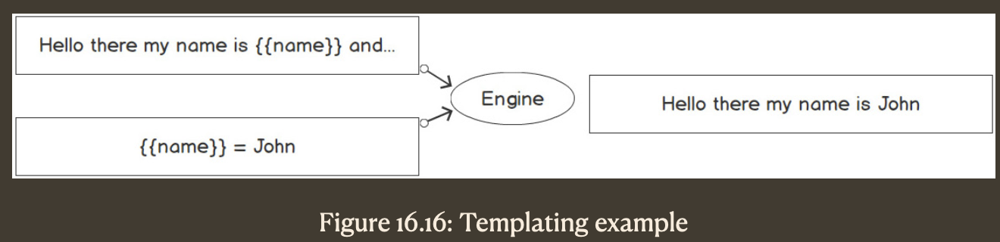

## Introduction

A web server is a program that uses the HTTP protocol – hence, the HTTP server – to accept requests from any HTTP client (web browser, another program, and so on) and respond to them with an appropriate message. When we browse the internet with our browser, it will be an HTTP server that will send an HTML page to our browser and we will be able to see it. In some other cases, a server will not return an HTML page but a different message that’s appropriate to the client.

Excerpt From: Samantha Coyle. “Go Programming - From Beginner to Professional.” Apple Books.

---

### HTTP handler

To react to an HTTP request, we need to write something that, we usually say, handles the request; hence, we call this something a handler.

In Go, we have several ways to do that, and one way is to implement the handler interface of the `http` package.

```go
ServeHTTP(w http.ResponseWriter, r *http.Request)
```

So, whenever we need to create a handler for HTTP requests, we can create a struct that includes this method and we can use it to handle an HTTP request. Here’s an example:

```go
type MyHandler struct {}
func(h MyHandler) ServeHTTP(w http.ResponseWriter, r *http.Request) {}
```

This is a valid HTTP handler and you can use it like so:

```go
http.ListenAndServe(":8080", MyHandler{})
```

Here, `ListenAndServe()` is a function that will use our handler to serve the requests; any struct that implements the handler interface will be fine.

The `ServeHTTP` method accepts `ResponseWriter` and a `Request` object. You can use them to capture parameters from the request and write messages to the response. The simplest thing, for example, is to let our server return a message:

```go
func(h MyHandler) ServeHTTP(w http.ResponseWriter, r *http.Request) {
  _, err := w.Write([]byte("HI"))
  if err != nil {
    log.Printf("an error occurred: %v\n", err)
    w.WriteHeader(http.StatusInternalServerError)
  }
}
```

The `ListenAndServe` method might return an error. If this happens, we will want the execution of our program to halt. One common practice is to wrap this function call with a fatal log:

```go
log.Fatal(http.ListenAndServe(":8080", MyHandler{}))
```

This will halt the execution and print the error message that’s returned by the `ListenAndServe` function.

---

### Simple routing

Now, we want to associate different messages with these different paths on our server. We will do this by introducing some simple routing to our server.

A path is what you see after 8080 in the URL, where 8080 is the port number we chose to run the server on. This path can be one number, a word, a set of numbers, or character groups separated by a `/`. To do this, we will use another function of the net/http package:

```go
HandleFunc(pattern string, handler func(ResponseWriter, \*Request))
```

---

### Handler versus handler function

`http.Handle` and `http.HandleFunc`, both of which have a path as their first parameter, but which differ in terms of the second parameter. These 2 functions both ensure that a specific path is handled by a function.

`http.Handler` is any struct that has a method with this signature:

```go
ServeHTTP(w http.ResponseWriter, r *http.Request)
```

In both cases, there will always be a function with `http.ResponseWriter` and `*http.Request` as parameters that will handle the path. When one or the other might be chosen may just be a matter of personal preference in many cases, but i might be important – when creating a complex project, for example – to choose the right method. Doing so will ensure that the structure of the project is optimal. Different routes may appear better organized if they’re handled by handlers that belong to different packages, or might have to perform very few actions, as in our previous case; and a simple function might prove to be the ideal choice.

In general, for simple projects where you have a handful of simple pages, you may opt for `HandleFunc`. For example, let’s say you want to have static pages and there is no complex behavior on each page. In this case, it would be overkill to use an empty struct just for returning static text. The handler is more appropriate whenever you need to set some parameters, or if you want to keep track of something. As a general rule, let’s say that if you have a counter, `Handler` is the best choice because you can initialize a struct with a count of 0 and then increment it.

---
### Adding middleware

Sometimes, you will need to create a lot of functions to handle HTTP requests, maybe serving different paths in a URL, all performing different actions. You might need to create a function to handle a server returning a list of users, one with a list of projects, a route for updating some details, and all the functions doing different things.

That although these functions perform different actions, they will also have something in common. A common example is when these functions have to be performed on a secured environment, which means only for users that have been logged in.

```go
http.HandleFunc(
  "/hello1",
  func(w http.ResponseWriter,
  r *http.Request,
){
  msg := "Hello there, this is function 1"
  w.Write([]byte(msg))
})

http.HandleFunc(
  "/hello2",
  func(w http.ResponseWriter,
  r *http.Request,
){
  msg := "Hello there, and now we are in function 2"
  w.Write([]byte(msg))
})
```

Both functions will display a sentence that starts with `Hello there,`. Let’s find a way to extract this part of the behavior of these functions and create a 3rd function that will be used to perform the act of writing the initial cheering message:
```go
func Hello(next http.HandlerFunc) http.HandlerFunc {
  return func(w http.ResponseWriter, r *http.Request) {
    msg := "Hello there,"
    w.Write([]byte(msg))
    next.ServeHTTP(w, r)
  }
}
```

This function has the following signature:

```go
func Hello(next http.HandlerFunc) http.HandlerFunc
```
This means it is called `Hello,` accepts `http.HandlerFunc` as a parameter, and returns a result against `http.HandlerFunc`. This parameter is called `next` because it is the function that we will want to run next. Let’s look at the body of the function:
```go
  return func(w http.ResponseWriter, r *http.Request) {
    msg := "Hello there,"
    w.Write([]byte(msg))
    next.ServeHTTP(w, r)
  }
```

It returns a function that implements the `http.HandlerFunc` type and has the correct arguments and return type. This function will write a message stating `Hello there`, to the response writer, `w`, and then call the next function with the same response writer and request that the function without a name receives.

Now, let’s refactor our code to make it a bit easier to read. We’ll create 2 functions for the actions we want to perform:

```go
func Function1(w http.ResponseWriter, r *http.Request) {
  msg := " this is function 1"
  w.Write([]byte(msg))
}

func Function2(w http.ResponseWriter, r *http.Request) {
  msg := " and now we are in function 2"
  w.Write([]byte(msg))
}
```

Let’s see what our file looks like so far:

```go
package main

import (
  "log"
  "net/http"
)

func Hello(next http.HandlerFunc) http.HandlerFunc {
  return func(w http.ResponseWriter, r *http.Request) {
    msg := "Hello there,"
    w.Write([]byte(msg))
    next.ServeHTTP(w, r)
  }
}

func Function1(w http.ResponseWriter, r *http.Request) {
  msg := " this is function 1"
  w.Write([]byte(msg))
}

func Function2(w http.ResponseWriter, r *http.Request) {
  msg := " and now we are in function 2"
  w.Write([]byte(msg))
}
```

As you can see, we have our Hello function and 2 functions returning 2 different sentences to the response writer. The last step is to associate these functions with a path, like so:

```go
func main() {
  http.HandleFunc(
    "/hello1", Function1)
  http.HandleFunc(
    "/hello2", Function2)
  log.Fatal(http.ListenAndServe(":8085", nil))
}
```

As you can see, we pass functions 1 and 2 to each route. If you run the code on your machine and go to `http://localhost:8085/hello1`, you will see a message stating this is function 1. What we have not used yet, though, is the Hello function.
Let’s rewrite the last block of code and make use of it:

```go
func main() {
  http.HandleFunc(
    "/hello1", Hello(Function1))
  http.HandleFunc(
    "/hello2", Hello(Function2))
  log.Fatal(http.ListenAndServe(":8085", nil))
}
```

If you run this program again, you will see that the message has now changed to `Hello there, this is function 1`. The `Hello` function is essentially running before the `Function1` function and after doing its own work, it calls `Function` so that that function can also do its job. We call the Hello function `Middleware` as it acts as the man in the middle – it captures the request, does some work, and then calls the next function in line. By doing this, it is possible to chain many middleware by doing something like this:

```go
Hello(Middleware2(Middleware3((Function2)))
```

You can use this pattern to perform many common actions before or after the actual function that needs to be associated with a path on the URL.

---
### Dynamic content

A server that serves only static content is useful, but there is much more that can be done. An HTTP server can deliver content based on a more granular request, which is done by passing some parameters to the server. There are many ways to do so, but one simple way is to pass parameters to `querystring`. If the URL of the server is as follows:
```
http://localhost:8080
```
Then, we can add something like this:
```
http://localhost:8080?name=john
```
Here, `?name=john` is called a querystring string as it is a string representing a query. In this case, querystring sets a variable called `name` with a value of `john`. This way of passing parameters is generally used with `GET` requests, while a `POST` request will generally make use of the body of the request to send parameters.

We will begin by looking at how to accept parameters for a `GET` request since this request is made by simply opening our browser on a specific address.

---
### Templating
Although JSON can be the best choice when complex data structures have to be shared across software programs, in general, this is not the case when the HTTP server is supposed to be consumed by humans.

A template is a skeleton from which complex entities can be developed. Essentially, a template is like text with some blanks. A template engine will take some values and fill in the blanks, as shown in the following diagram:


Go provides 2 different templating packages – one for text and one for HTML. As we are working with HTTP servers and we want to produce a web page, we will use the HTML templating package, but the interface is the same for the text template library. Although the templating packages are good enough for any real-world application, several other external packages can be used to improve performance. One of these is the hero template engine, which is much faster than the standard Go templating package.

---