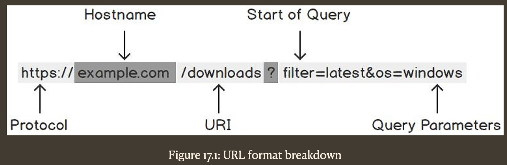

## Introduction

An HTTP client is something that is used to get data from or send data to a web server. Probably the most well-known example of an HTTP client is a web browser (such as Firefox, Chrome, and Microsoft Edge).

When you enter a web address into a web browser, it will have an HTTP client built in that sends a request to the server for data. The server will gather the data and send it back to the HTTP client, which will then display the web page in the browser. Similarly, when you fill out a form in a web browser, for example, when you log in to a website, the browser will use its HTTP client to send that form data to the server and then take appropriate action, depending on the response.

---

### The Go HTTP Client and its uses

The Go HTTP Client is part of the Go standard library, specifically the `net/http` package.

There are 2 main ways to use it.

- The 1st is to use the default HTTP client that is included in the `net/http` package. It’s simple to use and allows you to get up and running quickly.
- The 2nd way is to create your own HTTP client based on the default HTTP client. This allows you to customize the requests and various other things. It takes longer to configure, but it gives you much more freedom and control over the requests you send.

When using an HTTP client, you can send different types of requests. While there are many types of requests, we will discuss the two main ones: the `GET` request and the `POST` request. For instance, if you wanted to retrieve data from a server, you would send a GET request. When you enter a web address in your web browser, it will send a GET request to the server at that address and then display the data it returns. If you wanted to send data to the server, you would send a `POST` request. If you wanted to log into a website, you would `POST` your login details to the server.

---

## Sending a request to a server

When you want to retrieve data from a web server, you send a `GET` request to the server. When sending a request, the URL will contain information on the resource from which you want data. These include the `protocol`, the `hostname`, the `URI`, and the `query parameters`.



We can see the following in this example:

- `Protocol` tells the client how to connect to the server. The 2 most common protocols are `HTTP` and `HTTPS`.
- `Hostname` is the address of the server we want to connect to.
- `URI` is the uniform resource identifier, and this tells the server the path to the resource we want.
- `Query Parameters` tells the server about any additional information it needs. In this example, we have two query parameters. These are filter=latest and os=windows. You will notice they are separated from the URI by ?. This is so the server can parse them from the request. We join any additional parameters to the end of the URI with the & symbol, as seen with the os parameter.

---

### Structured data

Once you have requested data from a server, the data returned can come in various formats.

For example, if you send a request to packtpub.com, it will return HTML data for the Packt website. While HTML data is useful for displaying websites, it isn’t ideal for sending machine-readable data. A common data type used in web APIs is JSON. JSON provides a good structure for data that is both machine-readable and human-readable.

---
### Sending data to a server

In addition to requesting data from a server, you will also want to send data to a server. The most common way of doing this is via a `POST` request. 

A `POST` request comes in 2 main parts: the URL and the body. The body of a POST request is where you put the data you want to send to the server. A common example of this is a login form. When we send a login request, we POST the body to the URL. The web server then checks that the login details within the body are correct and updates our login status. It responds to the request by telling the client whether it succeeded or not.

---
### Uploading files in a POST request

Another common example of data you might want to post to a web server is a file from your local computer. This is how websites allow users to upload their photos and so on. As you can imagine, this is more complex than sending simple form data. To achieve this, the file needs to be read first and then wrapped in a format that the server can understand. It can then be sent in a POST request to the server in what’s called a multipart form.

---
### Custom request headers

Sometimes there is more to a request than simply requesting or sending data. This information is stored within the request headers. A very common example of this is authorization headers. When you log into a server, it will respond with an authorization token. In all future requests sent to the server, you would include this token in the request’s headers so the server knows you are the one making the requests.

---
### Race conditions

One important thing to consider is that whenever we run multiple functions concurrently, we have no guarantee in what order each instruction in each function will be performed.

In many architectures, this is not a problem. Some functions are not connected in any way with other functions, and whatever a function does in its Goroutine does not affect the actions performed in other Goroutines. This is, however, not always true. The first situation we can think of is when some functions need to share the same parameter. Some functions will read from this parameter, while others will write to this parameter. As we do not know which operation will run first, there is a high likelihood that one function will override the value updated by another function.

Let’s see an example that explains this situation:

```go
func next(v *int) {
  c := *v
  *v = c + 1
}
```

This function takes a pointer to an integer as a parameter. It is a pointer because we want to run several Goroutines with the `next()` function and update `v`. If we run the following code, we would expect that a will hold the value `3`:

```go
a := 0
next(&a)
next(&a)
next(&a)
```

This is perfectly fine. However, what if we run the following code:

```go
a := 0
go next(&a)
go next(&a)
go next(&a)
```

In this case, we might see that a holds `3`, or `2`, or `1`. Why would this happen? Because when a function executes the following statement, the value of `v` might be `0` for all functions running in independent Goroutines:

```go
c := *v
```

If this happens, then each function will set `v` to `c + 1`, which means none of the Goroutines are aware of what the other Goroutines are doing and override any changes made by another Goroutine. This problem is called a race condition and happens every time we work with shared resources without taking precautions. Fortunately, we have several ways to prevent this situation and to make sure that the same change is made only once. We will look at these solutions in the next sections, and we will explore the situation we just described in more detail, with a proper solution and race detection.

---
### Atomic operations
Let’s imagine we want to run independent functions again. However, in this case, we want to modify the value held by a variable. We still want to sum the numbers from 1 to 100, but we want to split the work into 2 concurrent Goroutines. We can sum the numbers from 1 to 50 in one routine and the numbers from 51 to 100 in another routine.

At the end, we will still need to receive the value of 5050, but two different routines can add a number at the same time to the same variable. Let’s see an example with only four numbers where we want to sum 1, 2, 3, and 4, and the result is 10.

Think of it like having a variable called `s := 0` and then making a loop where the value of `s` becomes the following:

```go
s = 0
s = 1
s = 3 // (1 + 2)
s = 6
s = 10
```

However, we could also have the following loop. In this case, the order in which the numbers are summed is different:

```go
s = 0
s = 1
s = 4 // 3 + 1, the previous value of 1
s = 6 // 2 + 4 the previous value of 4
s = 10
```

Essentially, this is just the commutative property of the sum, but this gives us a hint that we can split the sum into 2 or more concurrent calls. The problem that arises here is that all the functions need to manipulate the same variable, `s`, which can lead to race conditions and incorrect final values. A race condition happens when two processes change the same variable, and one process overrides the changes made by another process without considering the previous change. Thankfully, we have a package called atomic that allows us to safely modify variables across Goroutines.

This package has some functions for executing simple concurrent safe operations on variables. Let’s look at an example:

```go
func AddInt32(addr *int32, delta int32) (new int32)
```

This code takes a pointer to `int32` and modifies it by adding the value it points at to the value of delta. If `addr` holds a value of 2 and delta is 4, after calling this function, `addr` will hold 6.

---