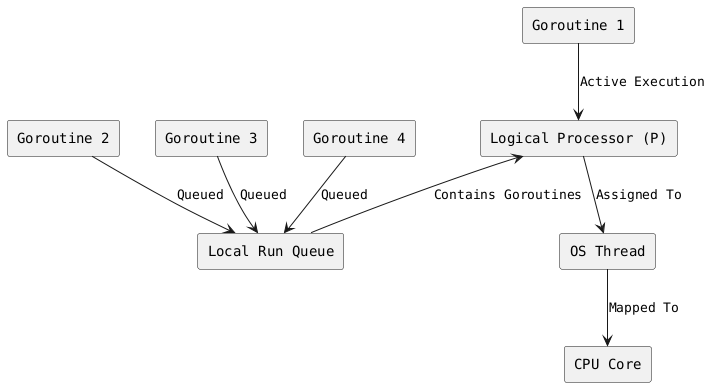
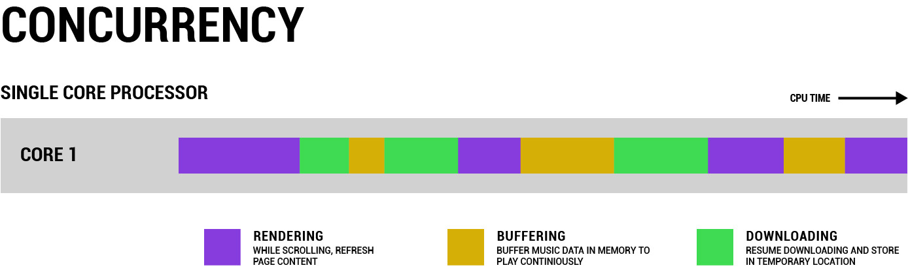

> Concurrency is about 𝐝𝐞𝐚𝐥𝐢𝐧𝐠 𝐰𝐢𝐭𝐡 lots of things at once.  Parallelism is about 𝐝𝐨𝐢𝐧𝐠 lots of things at once. -Rob Pike-

1. **Goroutine:**
   - Lightweight threads managed by the Go runtime.
   - Multiple goroutines can run concurrently on a single OS thread.
   - Goroutines are placed in a **local run queue** or a **global run queue** depending on the scheduling needs.

2. **OS Thread:**
   - A system-level thread provided by the operating system.
   - Goroutines are mapped onto OS threads, but Go handles this mapping for efficient concurrency.
   - Each OS thread is bound to a single **Logical Processor** at a time.

3. **Logical Processor (P):**
   - Represents a scheduling context in the Go runtime.
   - Acts as a mediator between goroutines and the OS threads.
   - Each logical processor maintains a **local run queue** of goroutines ready to execute.
   - The number of logical processors corresponds to the value of `GOMAXPROCS` (the maximum number of OS threads executing user code simultaneously).

4. **CPU Core:**
   - The actual hardware resource executing instructions.
   - OS threads are mapped to CPU cores as needed, but this is managed by the operating system, not Go directly.

5. **Local Run Queue:**
   - A queue of goroutines assigned to a specific logical processor.
   - Goroutines are scheduled from the local run queue onto the associated OS thread.

---

### **How It Works**

#### **1. Goroutine Scheduling**
- **Goroutines** are scheduled on **logical processors** (`P`), not directly on OS threads or CPU cores.
- Each logical processor has its **local run queue**, where it stores goroutines ready for execution.
- When a logical processor is idle or its local queue is empty, it may steal goroutines from other processors' queues or use the **global run queue**.

#### **2. OS Threads and Logical Processors**
- Each **logical processor (`P`)** is assigned exactly **one OS thread** at a time.
- The Go runtime schedules goroutines on this thread, which executes them on the associated CPU core.

#### **3. Execution on CPU Cores**
- The operating system maps OS threads to CPU cores as needed.
- The CPU core runs the instructions of the OS thread, which in turn executes the goroutines.

---

### **Detailed Analysis of the Illustration**

1. **Goroutine 1 Execution:**
   - **Goroutine 1** is being executed directly by the **OS thread** associated with a **logical processor** (`P`).
   - This goroutine is active, meaning it's currently using the CPU core.

2. **Goroutines in Local Run Queue:**
   - **Goroutines 2, 3, and 4** are waiting in the **local run queue** of the logical processor.
   - When **Goroutine 1** finishes or is blocked (e.g., waiting for I/O), one of these goroutines will be dequeued and scheduled for execution.

3. **Interaction Between Components:**
   - The **OS thread** and **logical processor** coordinate to execute goroutines efficiently.
   - The CPU core executes the instructions of the OS thread.

4. **Scalability:**
   - If the number of goroutines exceeds the capacity of the local queue or logical processors, the Go runtime uses a **global run queue** or spawns additional OS threads (up to `GOMAXPROCS`).

---

### **Key Insights**
1. **Concurrency Without Overhead:**
   - Goroutines are lightweight and managed by the Go runtime, avoiding the high overhead of creating and switching between OS threads.

2. **Efficient Use of CPU:**
   - The Go runtime optimizes CPU utilization by balancing goroutines across logical processors.
   - Idle logical processors can steal work from others to ensure all CPU cores are utilized efficiently.

3. **Control with `GOMAXPROCS`:**
   - The number of logical processors (`P`) can be controlled using `runtime.GOMAXPROCS`. This allows developers to limit or expand the number of OS threads running goroutines concurrently.

---

### **Limitations**
- If the program creates too many goroutines, it may lead to **goroutine thrashing**, where the scheduler spends more time managing goroutines than executing them.
- Blocking OS calls (e.g., system I/O) can block an entire OS thread, potentially reducing concurrency if not handled properly (Go mitigates this with its own runtime optimizations).
